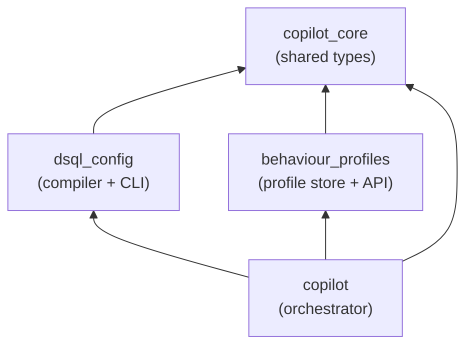
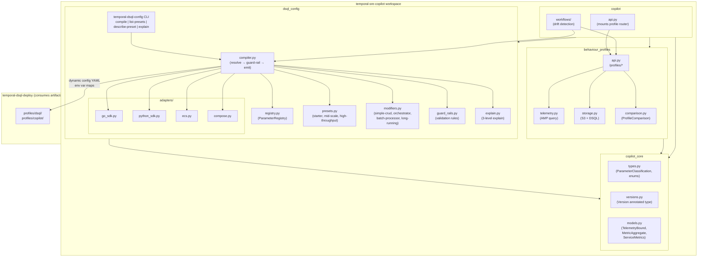
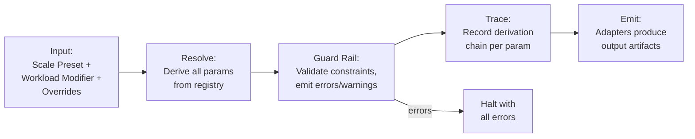

# Design Document: Enhanced Configuration UX

## Overview

This design covers two interconnected systems that simplify the Temporal DSQL configuration experience:

1. **Config Compiler** — A Python library and CLI (`temporal-dsql-config`) that collapses hundreds of configuration parameters into ~15 surfaced inputs. An adopter selects a Scale Preset (e.g., "mid-scale") and optionally a workload modifier (e.g., "batch-processor"), the compiler derives all Safety and Tuning parameters, applies guard rails, and emits validated artifacts through pluggable adapters.

2. **Behaviour Profile API** — FastAPI endpoints on the SRE Copilot that snapshot a time window of a running cluster (config + curated telemetry + version metadata) into a labelled profile. Profiles enable comparison, drift detection, and preset validation.

The two form a feedback loop: behaviour profiles validate that presets produce expected telemetry, and the Copilot recommends preset changes when observed behaviour drifts.

### Key Design Decisions

1. **uv workspace monorepo** — The `temporal-sre-copilot` repo is structured as a uv workspace with four member packages under `packages/`. The workspace root `pyproject.toml` is NOT a package — it only declares `[tool.uv] workspace = { members = ["packages/*"] }`. A single `uv.lock` at the root pins all dependencies.

2. **Four packages with a strict DAG** — `copilot_core` (shared types, no internal deps) → `dsql_config` (compiler, depends on `copilot_core`) and `behaviour_profiles` (profile store, depends on `copilot_core`) → `copilot` (orchestrator, depends on all three). Critically, `dsql_config` does NOT depend on `behaviour_profiles`.

3. **Parameter Registry is the single source of truth** — Every configuration parameter is registered with its classification, default derivation logic, rationale string, and guard rail constraints. Presets compose over the registry; they don't duplicate parameter definitions.

4. **Adapters are protocol-based with entry_point discovery** — SDK and Platform adapters implement a Python `Protocol` and are discovered at runtime via `importlib.metadata.entry_points()`. New adapters (e.g., Rust SDK, EKS Helm) are shipped as separate packages that register under well-known entry point groups. `uv add temporal-dsql-gen-rust` makes Rust output appear automatically — no core compiler changes needed. Entry points are declared in `dsql_config`'s `pyproject.toml`.

5. **Behaviour Profiles stored in S3, indexed in DSQL** — The full JSON document (config + telemetry) goes to S3. DSQL stores metadata for listing, filtering, and baseline designation. This keeps DSQL row sizes small.

6. **Explain is deterministic** — All three explain levels use template-based rendering from structured metadata. No LLM involvement. The parameter registry's rationale strings and the compilation trace provide all the data needed.

7. **Version fields use `packaging.version.Version`** — All version metadata (Temporal server, DSQL plugin, compiler) uses `from packaging.version import Version` for PEP 440 semantics (proper comparison, ordering, pre-release handling). Git SHAs remain `str`. Pydantic models use a custom annotated type with `PlainSerializer`/`PlainValidator` for JSON round-tripping (`Version` ↔ `str`). This annotated type lives in `copilot_core.versions`.

## Workspace Structure

```
temporal-sre-copilot/
├── pyproject.toml              # workspace root (NOT a package)
├── uv.lock                     # single lockfile
├── packages/
│   ├── copilot_core/           # shared types, signal defs, common utilities
│   │   ├── pyproject.toml
│   │   └── src/copilot_core/
│   │       ├── __init__.py
│   │       ├── types.py        # ParameterClassification, ParameterValueType, etc.
│   │       ├── versions.py     # Version annotated type for Pydantic serialization
│   │       ├── signals.py      # Signal taxonomy (shared between copilot and profiles)
│   │       └── models.py       # Shared base models (TelemetryBound, MetricAggregate, etc.)
│   │
│   ├── dsql_config/            # config compiler + generators (CLI: temporal-dsql-config)
│   │   ├── pyproject.toml
│   │   └── src/dsql_config/
│   │       ├── __init__.py
│   │       ├── registry.py     # ParameterRegistry
│   │       ├── compiler.py     # ConfigCompiler
│   │       ├── guard_rails.py  # GuardRailEngine
│   │       ├── presets.py      # Scale presets
│   │       ├── modifiers.py    # Workload modifiers
│   │       ├── explain.py      # Explain capability (3 levels)
│   │       ├── models.py       # ConfigProfile, CompilationResult, etc.
│   │       ├── cli.py          # Typer CLI entry point
│   │       └── adapters/
│   │           ├── __init__.py # Protocols, discovery
│   │           ├── go_sdk.py
│   │           ├── python_sdk.py
│   │           ├── ecs.py
│   │           └── compose.py
│   │
│   ├── behaviour_profiles/     # profile schema + storage + comparison
│   │   ├── pyproject.toml
│   │   └── src/behaviour_profiles/
│   │       ├── __init__.py
│   │       ├── models.py       # BehaviourProfile, ConfigSnapshot, TelemetrySummary, etc.
│   │       ├── comparison.py   # ProfileComparison logic
│   │       ├── storage.py      # S3 + DSQL storage
│   │       ├── telemetry.py    # AMP query for telemetry collection
│   │       └── api.py          # FastAPI router for /profiles/*
│   │
│   └── copilot/                # existing copilot project (moved here)
│       ├── pyproject.toml
│       └── src/copilot/
│           ├── ... (existing copilot code)
│           ├── workflows/
│           ├── activities/
│           ├── agents/
│           ├── models/
│           ├── db/
│           ├── cli/
│           ├── api.py          # Main FastAPI app, mounts profile router
│           └── worker.py
│
├── tests/                      # Shared test directory
│   ├── properties/
│   │   ├── test_config_compiler.py   # Properties 1-12, 22-26
│   │   └── test_behaviour_profiles.py # Properties 13-21
│   ├── test_presets.py
│   ├── test_guard_rails.py
│   ├── test_adapters.py
│   ├── test_backward_compat.py
│   ├── test_profile_api.py
│   └── test_profile_comparison.py
```

### Dependency Graph (strict DAG, no cycles)



### Package pyproject.toml Examples

**Workspace root** (`pyproject.toml`):
```toml
[project]
name = "temporal-sre-copilot-workspace"
version = "0.1.0"
requires-python = ">=3.14"

[tool.uv]
workspace = { members = ["packages/*"] }
```

**copilot_core** (`packages/copilot_core/pyproject.toml`):
```toml
[project]
name = "copilot-core"
version = "0.1.0"
requires-python = ">=3.14"
dependencies = [
    "pydantic>=2.0",
    "packaging>=24.0",
]
```

**dsql_config** (`packages/dsql_config/pyproject.toml`):
```toml
[project]
name = "dsql-config"
version = "0.1.0"
requires-python = ">=3.14"
dependencies = [
    "copilot-core",
    "pydantic>=2.0",
    "typer>=0.12",
    "rich>=13.0",
    "pyyaml>=6.0",
]

[project.scripts]
temporal-dsql-config = "dsql_config.cli:app"

[project.entry-points."temporal_dsql.sdk_adapters"]
go = "dsql_config.adapters.go_sdk:GoSDKAdapter"
python = "dsql_config.adapters.python_sdk:PythonSDKAdapter"

[project.entry-points."temporal_dsql.platform_adapters"]
ecs = "dsql_config.adapters.ecs:ECSAdapter"
compose = "dsql_config.adapters.compose:ComposeAdapter"

[tool.uv.sources]
copilot-core = { workspace = true }
```

**behaviour_profiles** (`packages/behaviour_profiles/pyproject.toml`):
```toml
[project]
name = "behaviour-profiles"
version = "0.1.0"
requires-python = ">=3.14"
dependencies = [
    "copilot-core",
    "pydantic>=2.0",
    "fastapi>=0.115",
    "asyncpg>=0.30",
    "aiobotocore>=2.0",
]

[tool.uv.sources]
copilot-core = { workspace = true }
```

**copilot** (`packages/copilot/pyproject.toml`):
```toml
[project]
name = "copilot"
version = "0.1.0"
requires-python = ">=3.14"
dependencies = [
    "copilot-core",
    "dsql-config",
    "behaviour-profiles",
    # ... existing copilot deps
]

[tool.uv.sources]
copilot-core = { workspace = true }
dsql-config = { workspace = true }
behaviour-profiles = { workspace = true }
```


## Architecture



### Compilation Pipeline



## Components and Interfaces

### What Lives Where

**copilot_core** — Shared foundation (no internal deps):
- `types.py`: `ParameterClassification`, `ParameterValueType`, `ParameterUnit`, `OutputTarget` enums; `ParameterConstraints`, `ParameterEntry`, `ResolvedParameter`, `ParameterOverrides` models
- `versions.py`: `VersionType` annotated type (`packaging.version.Version` with Pydantic serializer/validator)
- `models.py`: `TelemetryBound`, `MetricAggregate`, `ServiceMetrics` (shared between config and profiles)
- `signals.py`: Signal taxonomy types

**dsql_config** — Config compiler:
- `registry.py`: `ParameterRegistry`
- `compiler.py`: `ConfigCompiler`
- `guard_rails.py`: `GuardRailEngine`, `GuardRailResult`
- `presets.py`: `ScalePreset`, `ThroughputRange`, `PresetDefault`, `DerivationRule`
- `modifiers.py`: Workload modifier definitions
- `models.py`: `ConfigProfile`, `CompilationResult`, `CompilationTrace`, `DSQLPluginConfig`
- `explain.py`: `KeyExplanation`, `PresetExplanation`, `ProfileExplanation`, `LockedParam`, `OverrideDetail`
- `cli.py`: Typer CLI entry point
- `adapters/`: Protocols, discovery, built-in adapters

**behaviour_profiles** — Profile store:
- `models.py`: `BehaviourProfile`, `ConfigSnapshot`, `TelemetrySummary` and all telemetry sub-models; `ProfileComparison`, `ConfigDiff`, `TelemetryDiff`, `VersionDiff`; `ProfileMetadata`, `CreateProfileRequest`, `CompareRequest`
- `comparison.py`: Comparison logic
- `storage.py`: S3 + DSQL storage layer
- `telemetry.py`: AMP query for telemetry collection
- `api.py`: FastAPI router for `/profiles/*`

**copilot** — Orchestrator:
- `api.py`: Main FastAPI app, mounts `behaviour_profiles.api` router
- Drift detection and conformance assessment (uses both `dsql_config` and `behaviour_profiles`)

### Parameter Registry (copilot_core + dsql_config)

The core enums and models live in `copilot_core.types`. The registry itself lives in `dsql_config.registry`.

```python
# copilot_core/types.py
from enum import StrEnum
from pydantic import BaseModel


class ParameterClassification(StrEnum):
    SLO = "slo"
    TOPOLOGY = "topology"
    SAFETY = "safety"
    TUNING = "tuning"


class ParameterValueType(StrEnum):
    INT = "int"
    FLOAT = "float"
    STR = "str"
    DURATION = "duration"
    BOOL = "bool"


class ParameterUnit(StrEnum):
    PER_SEC = "per_sec"
    MILLISECONDS = "ms"
    SECONDS = "s"
    MINUTES = "m"
    CONNECTIONS = "connections"
    COUNT = "count"
    PERCENT = "percent"
    BYTES = "bytes"


class ParameterConstraints(BaseModel):
    min_value: float | None = None
    max_value: float | None = None
    allowed_values: list[str | int | float | bool] | None = None


class OutputTarget(StrEnum):
    DYNAMIC_CONFIG = "dynamic_config"
    ENV_VARS = "env_vars"
    WORKER_OPTIONS = "worker_options"
    DSQL_PLUGIN = "dsql_plugin"


class ParameterEntry(BaseModel):
    key: str
    classification: ParameterClassification
    description: str
    rationale: str
    default_value: int | float | str | bool
    value_type: ParameterValueType
    unit: ParameterUnit | None = None
    constraints: ParameterConstraints | None = None
    output_targets: list[OutputTarget]


class ResolvedParameter(BaseModel):
    key: str
    value: int | float | str | bool
    classification: ParameterClassification
    source: Literal["preset", "modifier", "override", "derived", "default"]


class ParameterOverrides(BaseModel):
    values: dict[str, int | float | str | bool] = {}
```

```python
# copilot_core/versions.py
from typing import Annotated
from packaging.version import Version
from pydantic import PlainSerializer, PlainValidator

VersionType = Annotated[
    Version,
    PlainValidator(lambda v: Version(v) if isinstance(v, str) else v),
    PlainSerializer(lambda v: str(v)),
]
```

```python
# copilot_core/models.py
from pydantic import BaseModel


class TelemetryBound(BaseModel):
    metric: str
    lower: float
    upper: float


class MetricAggregate(BaseModel):
    min: float
    max: float
    mean: float
    p50: float
    p95: float
    p99: float


class ServiceMetrics(BaseModel):
    history: MetricAggregate
    matching: MetricAggregate
    frontend: MetricAggregate
    worker: MetricAggregate
```

### Config Compiler (dsql_config)

```python
# dsql_config/compiler.py
from copilot_core.types import ParameterOverrides
from dsql_config.registry import ParameterRegistry
from dsql_config.models import ConfigProfile, CompilationResult, PresetSummary, PresetDescription
from dsql_config.adapters import SDKAdapter, PlatformAdapter
from dsql_config.explain import KeyExplanation, PresetExplanation, ProfileExplanation


class ConfigCompiler:
    def __init__(
        self,
        registry: ParameterRegistry,
        *,
        sdk_adapters: list[SDKAdapter] | None = None,
        platform_adapters: list[PlatformAdapter] | None = None,
    ) -> None: ...

    def compile(
        self,
        preset: str,
        *,
        modifier: str | None = None,
        overrides: ParameterOverrides | None = None,
        sdk: str | None = None,
        platform: str | None = None,
    ) -> CompilationResult: ...

    def list_presets(self) -> list[PresetSummary]: ...

    def describe_preset(
        self,
        preset: str,
        *,
        modifier: str | None = None,
    ) -> PresetDescription: ...

    def explain_key(self, key: str, profile: ConfigProfile) -> KeyExplanation: ...

    def explain_preset(
        self,
        preset: str,
        *,
        modifier: str | None = None,
    ) -> PresetExplanation: ...

    def explain_profile(self, profile: ConfigProfile) -> ProfileExplanation: ...
```

### Adapter Protocols and Plugin Discovery (dsql_config)

```python
# dsql_config/adapters/__init__.py
from dataclasses import dataclass
from typing import Protocol, runtime_checkable
from importlib.metadata import entry_points

from dsql_config.models import ConfigProfile


@dataclass(frozen=True)
class RenderedSnippet:
    language: str
    filename: str
    content: str


@runtime_checkable
class SDKAdapter(Protocol):
    language: str
    name: str

    def render(self, profile: ConfigProfile) -> RenderedSnippet: ...


@runtime_checkable
class PlatformAdapter(Protocol):
    platform: str
    name: str

    def render(self, profile: ConfigProfile) -> list[RenderedSnippet]: ...


SDK_ADAPTER_GROUP = "temporal_dsql.sdk_adapters"
PLATFORM_ADAPTER_GROUP = "temporal_dsql.platform_adapters"


def discover_sdk_adapters() -> list[SDKAdapter]:
    eps = entry_points(group=SDK_ADAPTER_GROUP)
    adapters: list[SDKAdapter] = []
    for ep in eps:
        obj = ep.load()
        adapter = obj() if callable(obj) else obj
        if not isinstance(adapter, SDKAdapter):
            raise TypeError(f"{ep.name} does not implement SDKAdapter")
        adapters.append(adapter)
    return adapters


def discover_platform_adapters() -> list[PlatformAdapter]:
    eps = entry_points(group=PLATFORM_ADAPTER_GROUP)
    adapters: list[PlatformAdapter] = []
    for ep in eps:
        obj = ep.load()
        adapter = obj() if callable(obj) else obj
        if not isinstance(adapter, PlatformAdapter):
            raise TypeError(f"{ep.name} does not implement PlatformAdapter")
        adapters.append(adapter)
    return adapters
```

### Guard Rails (dsql_config)

```python
# dsql_config/guard_rails.py
from typing import Literal
from pydantic import BaseModel
from dsql_config.models import ConfigProfile


class GuardRailResult(BaseModel):
    rule_name: str
    severity: Literal["error", "warning"]
    message: str
    parameter_keys: list[str]


class GuardRailEngine:
    def evaluate(self, profile: ConfigProfile) -> list[GuardRailResult]: ...
```

### Compilation Result (dsql_config)

```python
# dsql_config/models.py
from typing import Literal
from packaging.version import Version
from pydantic import BaseModel

from copilot_core.types import (
    ParameterClassification,
    ParameterOverrides,
    ResolvedParameter,
)
from copilot_core.versions import VersionType
from copilot_core.models import TelemetryBound


class ConfigProfile(BaseModel):
    preset_name: str
    modifier: str | None = None
    overrides: ParameterOverrides = ParameterOverrides()

    slo_params: list[ResolvedParameter]
    topology_params: list[ResolvedParameter]
    safety_params: list[ResolvedParameter]
    tuning_params: list[ResolvedParameter]

    temporal_server_version: VersionType
    dsql_plugin_version: VersionType

    compiled_at: str
    compiler_version: VersionType

    def get_param(self, key: str) -> ResolvedParameter | None:
        for param_list in (self.slo_params, self.topology_params,
                           self.safety_params, self.tuning_params):
            for p in param_list:
                if p.key == key:
                    return p
        return None


class CompilationTrace(BaseModel):
    parameter_key: str
    source: Literal["preset", "modifier", "override", "derived", "default"]
    base_value: int | float | str | bool
    final_value: int | float | str | bool
    derivation_chain: list[str]


class DSQLPluginConfig(BaseModel):
    reservoir_enabled: bool
    reservoir_target_ready: int
    reservoir_base_lifetime_min: float
    reservoir_lifetime_jitter_min: float
    reservoir_guard_window_sec: float
    reservoir_inflight_limit: int
    max_conns: int
    max_idle_conns: int
    max_conn_lifetime_min: float
    connection_rate_limit: int
    connection_burst_limit: int
    distributed_rate_limiter_enabled: bool
    distributed_rate_limiter_table: str | None = None
    token_bucket_enabled: bool
    token_bucket_rate: int | None = None
    token_bucket_capacity: int | None = None
    slot_block_enabled: bool
    slot_block_size: int | None = None
    slot_block_count: int | None = None


class CompilationResult(BaseModel):
    profile: ConfigProfile
    dynamic_config_yaml: str
    dsql_plugin_config: DSQLPluginConfig
    sdk_snippets: list[RenderedSnippet]
    platform_snippets: list[RenderedSnippet]
    guard_rail_results: list[GuardRailResult]
    trace: list[CompilationTrace]
    why_section: str


class ThroughputRange(BaseModel):
    min_st_per_sec: float
    max_st_per_sec: float | None
    description: str


class PresetDefault(BaseModel):
    key: str
    value: int | float | str | bool


class DerivationRule(BaseModel):
    key: str
    expression: str
    depends_on: list[str]


class ScalePreset(BaseModel):
    name: str
    description: str
    throughput_range: ThroughputRange
    slo_defaults: list[PresetDefault]
    topology_defaults: list[PresetDefault]
    safety_derivations: list[DerivationRule]
    tuning_derivations: list[DerivationRule]
    expected_bounds: list[TelemetryBound] | None = None
```

### Explain Models (dsql_config)

```python
# dsql_config/explain.py
from pydantic import BaseModel
from copilot_core.types import ParameterClassification, ResolvedParameter
from dsql_config.models import CompilationTrace
from dsql_config.guard_rails import GuardRailResult


class KeyExplanation(BaseModel):
    key: str
    classification: ParameterClassification
    value: int | float | str | bool
    description: str
    rationale: str
    source: Literal["preset", "modifier", "override", "derived", "default"]


class LockedParam(BaseModel):
    key: str
    value: int | float | str | bool
    reason: str


class PresetExplanation(BaseModel):
    preset_name: str
    modifier: str | None
    slo_targets: list[ResolvedParameter]
    topology_derivation: list[str]
    locked_safety_params: list[LockedParam]
    reasoning_narrative: str


class OverrideDetail(BaseModel):
    key: str
    preset_value: int | float | str | bool
    override_value: int | float | str | bool
    classification: ParameterClassification


class ProfileExplanation(BaseModel):
    base_preset: str
    modifier: str | None
    overrides_applied: list[OverrideDetail]
    guard_rails_fired: list[GuardRailResult]
    derivation_chains: list[CompilationTrace]
    composition_narrative: str
```

### Behaviour Profile Models (behaviour_profiles)

```python
# behaviour_profiles/models.py
from typing import Literal
from pydantic import BaseModel

from copilot_core.versions import VersionType
from copilot_core.models import MetricAggregate, ServiceMetrics
from copilot_core.types import ParameterClassification


class BehaviourProfile(BaseModel):
    id: str
    name: str
    label: str | None = None

    cluster_id: str
    namespace: str | None = None
    task_queue: str | None = None
    time_window_start: str
    time_window_end: str

    temporal_server_version: VersionType | None = None
    dsql_plugin_version: VersionType | None = None
    worker_code_sha: str | None = None

    config_snapshot: ConfigSnapshot
    telemetry: TelemetrySummary

    created_at: str
    is_baseline: bool = False


class ConfigSnapshot(BaseModel):
    dynamic_config: list[DynamicConfigEntry]
    server_env_vars: list[EnvVarEntry]
    worker_options: WorkerOptionsSnapshot
    dsql_plugin_config: DSQLPluginSnapshot
    config_profile: ConfigProfile | None = None


class DynamicConfigEntry(BaseModel):
    key: str
    value: int | float | str | bool | list[str]


class EnvVarEntry(BaseModel):
    name: str
    value: str
    redacted: bool = False


class WorkerOptionsSnapshot(BaseModel):
    max_concurrent_activities: int | None = None
    max_concurrent_workflow_tasks: int | None = None
    max_concurrent_local_activities: int | None = None
    workflow_task_pollers: int | None = None
    activity_task_pollers: int | None = None
    sticky_schedule_to_start_timeout_sec: float | None = None
    disable_eager_activities: bool | None = None


class DSQLPluginSnapshot(BaseModel):
    reservoir_enabled: bool
    reservoir_target_ready: int
    reservoir_base_lifetime_min: float
    reservoir_lifetime_jitter_min: float
    reservoir_guard_window_sec: float
    max_conns: int
    max_idle_conns: int
    max_conn_lifetime_min: float
    distributed_rate_limiter_enabled: bool
    token_bucket_enabled: bool
    token_bucket_rate: int | None = None
    token_bucket_capacity: int | None = None
    slot_block_enabled: bool
    slot_block_size: int | None = None
    slot_block_count: int | None = None


class TelemetrySummary(BaseModel):
    throughput: ThroughputMetrics
    latency: LatencyMetrics
    matching: MatchingMetrics
    dsql_pool: DSQLPoolMetrics
    errors: ErrorMetrics
    resources: ResourceMetrics


class ThroughputMetrics(BaseModel):
    workflows_started_per_sec: MetricAggregate
    workflows_completed_per_sec: MetricAggregate
    state_transitions_per_sec: MetricAggregate


class LatencyMetrics(BaseModel):
    workflow_schedule_to_start_p95: MetricAggregate
    workflow_schedule_to_start_p99: MetricAggregate
    activity_schedule_to_start_p95: MetricAggregate
    activity_schedule_to_start_p99: MetricAggregate
    persistence_latency_p95: MetricAggregate
    persistence_latency_p99: MetricAggregate


class MatchingMetrics(BaseModel):
    sync_match_rate: MetricAggregate
    async_match_rate: MetricAggregate
    task_dispatch_latency: MetricAggregate
    backlog_count: MetricAggregate
    backlog_age: MetricAggregate


class DSQLPoolMetrics(BaseModel):
    pool_open_count: MetricAggregate
    pool_in_use_count: MetricAggregate
    pool_idle_count: MetricAggregate
    reservoir_size: MetricAggregate
    reservoir_empty_events: MetricAggregate
    open_failures: MetricAggregate
    reconnect_count: MetricAggregate


class ErrorMetrics(BaseModel):
    occ_conflicts_per_sec: MetricAggregate
    exhausted_retries_per_sec: MetricAggregate
    dsql_auth_failures: MetricAggregate


class ResourceMetrics(BaseModel):
    cpu_utilization: ServiceMetrics
    memory_utilization: ServiceMetrics
    worker_task_slot_utilization: MetricAggregate


class ProfileMetadata(BaseModel):
    id: str
    name: str
    label: str | None
    cluster_id: str
    namespace: str | None
    time_window_start: str
    time_window_end: str
    is_baseline: bool
    created_at: str


class CreateProfileRequest(BaseModel):
    name: str
    cluster_id: str
    time_window_start: str
    time_window_end: str
    namespace: str | None = None
    task_queue: str | None = None
    label: str | None = None


class CompareRequest(BaseModel):
    profile_a_id: str
    profile_b_id: str
```

### Profile Comparison (behaviour_profiles)

```python
# behaviour_profiles/comparison.py / models.py
from typing import Literal
from pydantic import BaseModel

from copilot_core.versions import VersionType
from copilot_core.models import MetricAggregate
from copilot_core.types import ParameterClassification


class ProfileComparison(BaseModel):
    profile_a_id: str
    profile_b_id: str
    config_diffs: list[ConfigDiff]
    telemetry_diffs: list[TelemetryDiff]
    version_diffs: list[VersionDiff]


class ConfigDiff(BaseModel):
    key: str
    old_value: int | float | str | bool
    new_value: int | float | str | bool
    classification: ParameterClassification | None = None


class TelemetryDiff(BaseModel):
    metric: str
    old_value: MetricAggregate
    new_value: MetricAggregate
    change_pct: float
    direction: Literal["improved", "regressed", "unchanged"]
    severity: Literal["info", "warning", "critical"]


class VersionDiff(BaseModel):
    component: str
    old_version: VersionType | None
    new_version: VersionType | None
```

### Behaviour Profile API (behaviour_profiles)

```python
# behaviour_profiles/api.py
from fastapi import APIRouter

router = APIRouter(prefix="/profiles", tags=["profiles"])


@router.post("/")
async def create_profile(request: CreateProfileRequest) -> ProfileMetadata: ...

@router.get("/")
async def list_profiles(
    cluster: str | None = None,
    label: str | None = None,
    namespace: str | None = None,
) -> list[ProfileMetadata]: ...

@router.get("/{profile_id}")
async def get_profile(profile_id: str) -> BehaviourProfile: ...

@router.post("/{profile_id}/baseline")
async def set_baseline(profile_id: str) -> ProfileMetadata: ...

@router.post("/compare")
async def compare_profiles(request: CompareRequest) -> ProfileComparison: ...
```

The `copilot` package mounts this router:

```python
# copilot/api.py
from fastapi import FastAPI
from behaviour_profiles.api import router as profile_router

app = FastAPI()
app.include_router(profile_router)
```


## Correctness Properties

*A property is a characteristic or behavior that should hold true across all valid executions of a system — essentially, a formal statement about what the system should do. Properties serve as the bridge between human-readable specifications and machine-verifiable correctness guarantees.*

### Config Compiler Properties

**Property 1: Parameter classification uniqueness**
*For any* parameter in the registry, it SHALL be classified into exactly one Parameter_Classification (SLO, Topology, Safety, or Tuning) — no parameter is unclassified and no parameter belongs to multiple classifications.
**Validates: Requirements 1.1**

**Property 2: Derived parameter completeness**
*For any* valid Scale_Preset and Topology_Parameter combination, the compiled Config_Profile SHALL contain non-empty Safety_Parameter and Tuning_Parameter dictionaries, and every Safety and Tuning parameter defined in the registry SHALL have a resolved value.
**Validates: Requirements 1.4, 1.5**

**Property 3: Exposed parameter count invariant**
*For any* Scale_Preset (with or without a workload modifier), the total count of SLO_Parameters plus Topology_Parameters in the resolved Config_Profile SHALL be at most 15.
**Validates: Requirements 1.6**

**Property 4: Dynamic config YAML validity**
*For any* valid compilation (preset + optional modifier + optional overrides), the emitted dynamic config string SHALL be parseable as valid YAML and SHALL contain entries for all dynamic config parameters in the registry.
**Validates: Requirements 4.1**

**Property 5: Override application**
*For any* parameter that accepts overrides and any override value within the parameter's constraints, the final resolved value in the Config_Profile SHALL equal the override value, not the preset-derived default.
**Validates: Requirements 4.5**

**Property 6: Why section presence**
*For any* valid compilation, the CompilationResult SHALL contain a non-empty why_section string.
**Validates: Requirements 4.6**

**Property 7: Adapter output completeness**
*For any* valid Config_Profile and any discovered SDK_Adapter or Platform_Adapter, calling render SHALL return a RenderedSnippet (or list thereof) with non-empty content and a valid filename.
**Validates: Requirements 4a.5, 4b.5**

**Property 8: MaxIdleConns equals MaxConns guard rail**
*For any* configuration where MaxIdleConns does not equal MaxConns, the guard rail engine SHALL produce an error-severity GuardRailResult, and compilation SHALL halt.
**Validates: Requirements 5.5**

**Property 9: All guard rail errors reported**
*For any* configuration that triggers N guard rail errors (N ≥ 1), the CompilationResult SHALL contain exactly N error-severity GuardRailResults — no errors are swallowed or short-circuited.
**Validates: Requirements 5.8**

**Property 10: Config_Profile serialization round-trip**
*For any* valid Config_Profile, serializing to JSON then deserializing SHALL produce an equivalent Config_Profile. Similarly, serializing to YAML then deserializing SHALL produce an equivalent Config_Profile.
**Validates: Requirements 6.1, 6.2, 6.3, 6.4**

**Property 11: Describe-preset completeness and grouping**
*For any* Scale_Preset name (with optional modifier), the describe-preset output SHALL contain every parameter from the registry grouped by Parameter_Classification, with each group non-empty for at least SLO and Topology.
**Validates: Requirements 7.2, 7.3**

**Property 12: Redundant environment variable detection**
*For any* set of existing DSQL environment variables where a subset matches the preset-derived defaults, the compiler SHALL identify exactly that subset as redundant — no false positives and no false negatives.
**Validates: Requirements 8.3**

### Behaviour Profile Properties

**Property 13: Behaviour_Profile completeness**
*For any* created Behaviour_Profile, the profile SHALL contain non-null identity metadata (name, time window, cluster ID), a non-null ConfigSnapshot, and a non-null TelemetrySummary.
**Validates: Requirements 9.2, 9.3, 9.4**

**Property 14: Telemetry_Summary completeness**
*For any* TelemetrySummary, all six metric categories (throughput, latency, matching, dsql_pool, errors, resources) SHALL be present, and every MetricAggregate within SHALL contain all six statistical fields (min, max, mean, p50, p95, p99).
**Validates: Requirements 10.1, 10.2, 10.3, 10.4, 10.5, 10.6, 10.7**

**Property 15: Profile listing correctness**
*For any* set of stored profiles and any filter combination (cluster, label, namespace, time range), the listing endpoint SHALL return exactly the profiles matching all filters, and each result SHALL contain metadata without full telemetry data.
**Validates: Requirements 11.1, 11.3**

**Property 16: Profile retrieval identity**
*For any* created Behaviour_Profile, retrieving it by ID SHALL return a profile equivalent to the one that was created.
**Validates: Requirements 11.2**

**Property 17: Comparison completeness and ordering**
*For any* two Behaviour_Profiles, the Profile_Comparison SHALL include config diffs, telemetry diffs, and version diffs. Telemetry diffs SHALL be ordered by severity with the largest regressions first.
**Validates: Requirements 12.1, 12.2, 12.3, 12.4, 12.5**

**Property 18: Behaviour_Profile serialization round-trip**
*For any* valid Behaviour_Profile, serializing to JSON then deserializing SHALL produce an equivalent Behaviour_Profile.
**Validates: Requirements 13.1, 13.2, 13.3**

### Copilot Integration Properties

**Property 19: Drift detection**
*For any* current telemetry snapshot and Baseline_Profile where at least one metric deviates beyond the configured threshold, the health assessment SHALL flag the deviation as drift.
**Validates: Requirements 15.2**

**Property 20: Drift correlation**
*For any* Profile_Comparison that contains both configuration changes and telemetry regressions, the assessment explanation SHALL include the correlation between the config changes and the regressions.
**Validates: Requirements 15.3**

**Property 21: Preset conformance assessment**
*For any* Behaviour_Profile associated with a Scale_Preset, the conformance label SHALL be "conforming" if and only if all telemetry metrics fall within the preset's expected bounds, and "drifted" otherwise. The per-metric detail SHALL correctly report pass or fail for each metric.
**Validates: Requirements 16.1, 16.2, 16.3, 16.4**

### Explain Properties

**Property 22: Explain key completeness**
*For any* registered parameter key and compiled Config_Profile, the key explanation SHALL contain the parameter's purpose, classification, resolved value, and rationale — all non-empty.
**Validates: Requirements 17.1**

**Property 23: Explain preset completeness**
*For any* Scale_Preset name (with optional modifier), the preset explanation SHALL contain SLO targets, topology derivation steps, locked safety parameters with reasons, and a non-empty reasoning narrative.
**Validates: Requirements 17.2**

**Property 24: Explain profile completeness**
*For any* compiled Config_Profile, the profile explanation SHALL contain the base preset name, all applied overrides with before/after values, any guard rails that fired, and derivation chains for all non-default values.
**Validates: Requirements 17.3**

**Property 25: Explain determinism**
*For any* explain input (key, preset, or profile), calling the explain function twice with identical inputs SHALL produce identical output.
**Validates: Requirements 17.4**

**Property 26: Explain dual format**
*For any* explain call, both the human-readable text and structured JSON output formats SHALL be non-empty and parseable (JSON format SHALL be valid JSON).
**Validates: Requirements 17.6**

## Error Handling

### Config Compiler Errors

| Error Condition | Behavior |
|----------------|----------|
| Unknown preset name | Raise `UnknownPresetError` with available preset names |
| Unknown modifier name | Raise `UnknownModifierError` with available modifier names |
| Unknown parameter key in override | Raise `UnknownParameterError` with the key and suggestion |
| Override value outside constraints | Raise `ConstraintViolationError` with min/max/allowed values |
| Guard rail error(s) | Collect all errors, return `CompilationResult` with errors, halt artifact generation |
| Guard rail warning(s) | Include warnings in `CompilationResult`, continue artifact generation |
| Unknown parameter key in explain | Raise `UnknownParameterError` |
| Adapter render failure | Raise `AdapterError` with adapter name and cause |

### Behaviour Profile API Errors

| Error Condition | HTTP Status | Behavior |
|----------------|-------------|----------|
| Time range exceeds 24 hours | 400 | Return error with max window explanation |
| Profile not found | 404 | Return error with profile ID |
| AMP query failure | 502 | Return error with upstream details |
| S3 storage failure | 502 | Return error with storage details |
| DSQL connection failure | 503 | Return error indicating state store unavailable |
| Invalid filter parameters | 400 | Return error with valid filter options |
| Comparison with same profile ID | 400 | Return error explaining two different profiles required |

### Error Design Principles

1. All compiler errors are collected before halting — no fail-fast on first error
2. Guard rail warnings never halt compilation — only errors halt
3. API errors follow RFC 7807 problem detail format
4. All errors include actionable remediation guidance

## Testing Strategy

### Dual Testing Approach

This project uses both unit tests and property-based tests:

- **Unit tests**: Specific examples (preset compilation outputs, guard rail edge cases, adapter snapshots)
- **Property tests**: Universal properties across generated inputs (serialization round-trips, classification invariants, override application)

### Property-Based Testing Configuration

- **Library**: [Hypothesis](https://hypothesis.readthedocs.io/) (dev dependency at workspace root)
- **Minimum iterations**: 100 per property test
- **Tag format**: `# Feature: enhance-config-ux, Property {N}: {title}`
- **Location**: `tests/properties/` at workspace root

### Hypothesis Strategies

Custom strategies needed for generating:
- `ConfigProfile` instances with valid parameter combinations (imports from `dsql_config.models`)
- `BehaviourProfile` instances with realistic telemetry ranges (imports from `behaviour_profiles.models`)
- `MetricAggregate` instances with valid statistical relationships (min ≤ p50 ≤ mean ≤ p95 ≤ p99 ≤ max) (imports from `copilot_core.models`)
- Override dictionaries with valid parameter keys and constrained values
- Environment variable maps matching known DSQL variable names

### Test Organization

**Config Compiler tests** (`temporal-sre-copilot/tests/`):
- `tests/properties/test_config_compiler.py` — Properties 1-12, 22-26
- `tests/test_presets.py` — Unit tests for specific preset outputs (Requirements 2.2-2.7, 3.2-3.5)
- `tests/test_guard_rails.py` — Unit tests for guard rail edge cases (Requirements 5.1-5.7)
- `tests/test_adapters.py` — Unit tests for adapter output snapshots (Requirements 4a.2-4a.4, 4b.2-4b.4)
- `tests/test_backward_compat.py` — Unit tests for env var migration (Requirements 8.1-8.2)

**Behaviour Profile tests** (`temporal-sre-copilot/tests/`):
- `tests/properties/test_behaviour_profiles.py` — Properties 13-21
- `tests/test_profile_api.py` — Unit tests for API endpoints (Requirements 9.1, 9.5, 11.4)
- `tests/test_profile_comparison.py` — Unit tests for comparison edge cases

### Key Property Test Examples

Each correctness property maps to a single Hypothesis test:

```python
from dsql_config.models import ConfigProfile
from copilot_core.types import ParameterOverrides

# Feature: enhance-config-ux, Property 10: Config_Profile serialization round-trip
@given(profile=config_profiles())
def test_config_profile_round_trip(profile: ConfigProfile):
    json_str = profile.model_dump_json()
    restored = ConfigProfile.model_validate_json(json_str)
    assert restored == profile

# Feature: enhance-config-ux, Property 5: Override application
@given(
    preset=sampled_from(["starter", "mid-scale", "high-throughput"]),
    key=sampled_from(OVERRIDABLE_KEYS),
    value=valid_override_values(),
)
def test_override_replaces_default(
    preset: str, key: str, value: int | float | str | bool,
):
    result = compiler.compile(
        preset, overrides=ParameterOverrides(values={key: value}),
    )
    param = result.profile.get_param(key)
    assert param is not None
    assert param.value == value

# Feature: enhance-config-ux, Property 25: Explain determinism
@given(profile=config_profiles())
def test_explain_is_deterministic(profile: ConfigProfile):
    explanation_1 = compiler.explain_profile(profile)
    explanation_2 = compiler.explain_profile(profile)
    assert explanation_1 == explanation_2
```
