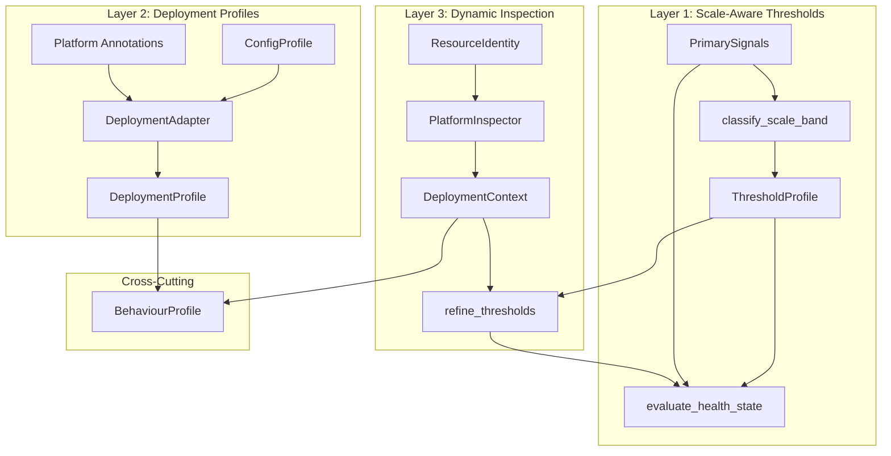
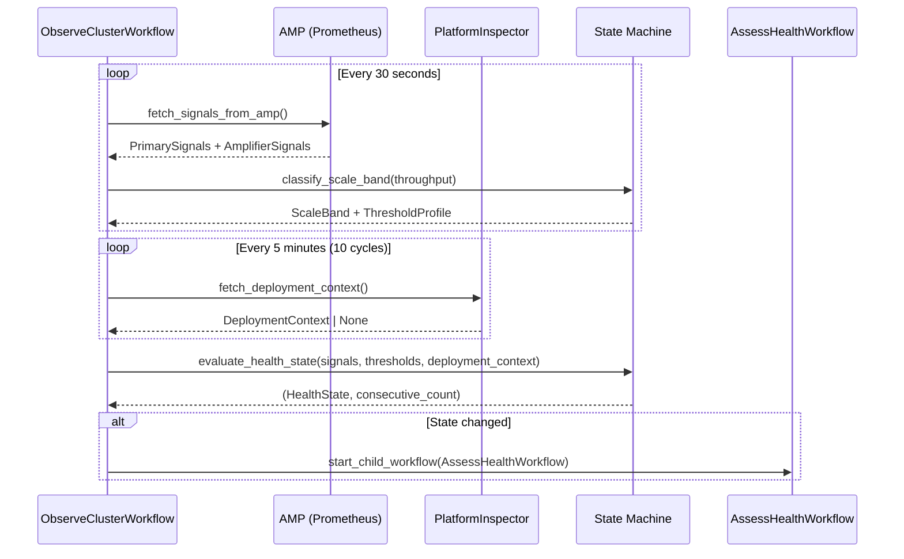
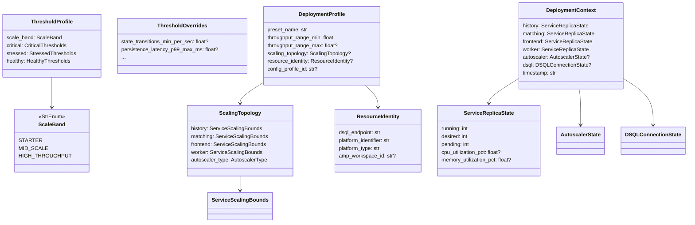

# Design Document: Scale-Aware Thresholds

## Overview

The Health State Machine currently evaluates cluster health using fixed thresholds calibrated for production-scale deployments (~150 wf/s). This produces false positives on low-throughput clusters: at 2 wf/s on a dev cluster, DSQL baseline persistence latency (300-400ms p99) exceeds the 100ms stressed gate, throughput falls in a dead zone between idle (<1 st/sec) and healthy (≥10 st/sec), and poller timeouts are expected behavior when there's little work to poll.

This design introduces a three-layer calibration system:

1. **Layer 1 — Scale-Aware Thresholds**: `evaluate_health_state()` classifies the cluster's throughput into a scale band (starter/mid-scale/high-throughput) and selects a calibrated threshold profile. This is the immediate fix.
2. **Layer 2 — Deployment Profiles**: The Config Compiler gains a `DeploymentProfile` model that captures scaling topology and resource identities, bridging "what we compiled" to "what we deployed."
3. **Layer 3 — Dynamic Inspection**: The Copilot inspects the monitored cluster's actual deployment state at runtime and feeds a `DeploymentContext` into health evaluation for threshold refinement.

All thresholds remain fully deterministic. The "Rules Decide, AI Explains" principle is preserved.

### Design Rationale

The three layers are ordered by increasing information richness and implementation complexity:
- Layer 1 requires only the throughput signal already available in `PrimarySignals` — zero new infrastructure.
- Layer 2 requires operator annotation at compile time — a one-time step.
- Layer 3 requires runtime platform queries — the most complex but most accurate.

Each layer is independently useful and backward compatible. A cluster with no deployment profile and no platform inspector still benefits from Layer 1's scale-band classification.

## Architecture

### High-Level System Diagram



### Data Flow



### Package Placement

| Component | Package | Rationale |
|-----------|---------|-----------|
| `ScaleBand`, `ThresholdProfile` | `copilot.models.config` | Health evaluation concern, only used by copilot |
| `classify_scale_band()` | `copilot.models.state_machine` | Pure function alongside `evaluate_health_state()` |
| `DeploymentProfile`, `ScalingTopology`, `ResourceIdentity` | `copilot_core.deployment` | Shared between `dsql_config` (produces) and `copilot` (consumes) |
| `DeploymentContext`, `ServiceReplicaState`, `AutoscalerState` | `copilot_core.deployment` | Shared type consumed by copilot, stored in behaviour profiles |
| `DeploymentAdapter` protocol | `dsql_config.adapters` | Alongside existing `SDKAdapter`, `PlatformAdapter` |
| `ECSDeploymentAdapter`, `ComposeDeploymentAdapter` | `dsql_config.adapters.ecs`, `dsql_config.adapters.compose` | Platform-specific implementations |
| `PlatformInspector` protocol | `copilot.inspectors` | Runtime inspection is an orchestrator concern |
| `ECSInspector`, `ComposeInspector` | `copilot.inspectors.ecs`, `copilot.inspectors.compose` | Platform-specific implementations |
| `fetch_deployment_context` activity | `copilot.activities.inspect` | Temporal activity for deployment inspection |

## Components and Interfaces

### Layer 1: Scale-Aware Thresholds

#### ScaleBand Enum

```python
# copilot/models/config.py

class ScaleBand(StrEnum):
    """Scale band aligned with Config Compiler presets."""
    STARTER = "starter"          # 0-50 st/sec
    MID_SCALE = "mid-scale"      # 50-500 st/sec
    HIGH_THROUGHPUT = "high-throughput"  # 500+ st/sec
```

#### classify_scale_band()

Pure function. No external state, no LLM. Hysteresis prevents flapping at boundaries.

```python
# copilot/models/state_machine.py

# Boundaries aligned with Config Compiler preset ThroughputRange
_SCALE_BAND_BOUNDARIES: list[tuple[float, float, ScaleBand]] = [
    (0.0, 50.0, ScaleBand.STARTER),
    (50.0, 500.0, ScaleBand.MID_SCALE),
    (500.0, float("inf"), ScaleBand.HIGH_THROUGHPUT),
]

# 10% hysteresis at each boundary
_HYSTERESIS_FACTOR = 0.10

def classify_scale_band(
    throughput_per_sec: float,
    current_band: ScaleBand | None = None,
) -> ScaleBand:
    """Classify throughput into a scale band with hysteresis.

    When current_band is provided, the boundary is shifted by 10%
    to prevent rapid oscillation. For example, the starter→mid-scale
    boundary at 50 st/sec becomes:
    - 55 st/sec to transition UP from starter to mid-scale
    - 45 st/sec to transition DOWN from mid-scale to starter

    Args:
        throughput_per_sec: Current observed state transitions per second.
        current_band: The band from the previous evaluation cycle (for hysteresis).

    Returns:
        The classified ScaleBand.
    """
    if current_band is None:
        # No hysteresis on first classification
        if throughput_per_sec < 50.0:
            return ScaleBand.STARTER
        elif throughput_per_sec < 500.0:
            return ScaleBand.MID_SCALE
        else:
            return ScaleBand.HIGH_THROUGHPUT

    # Apply hysteresis: require crossing boundary + margin to change band
    match current_band:
        case ScaleBand.STARTER:
            # Must exceed 50 * 1.10 = 55 to move up
            if throughput_per_sec >= 50.0 * (1 + _HYSTERESIS_FACTOR):
                return ScaleBand.MID_SCALE
            return ScaleBand.STARTER
        case ScaleBand.MID_SCALE:
            # Must drop below 50 * 0.90 = 45 to move down
            if throughput_per_sec < 50.0 * (1 - _HYSTERESIS_FACTOR):
                return ScaleBand.STARTER
            # Must exceed 500 * 1.10 = 550 to move up
            if throughput_per_sec >= 500.0 * (1 + _HYSTERESIS_FACTOR):
                return ScaleBand.HIGH_THROUGHPUT
            return ScaleBand.MID_SCALE
        case ScaleBand.HIGH_THROUGHPUT:
            # Must drop below 500 * 0.90 = 450 to move down
            if throughput_per_sec < 500.0 * (1 - _HYSTERESIS_FACTOR):
                return ScaleBand.MID_SCALE
            return ScaleBand.HIGH_THROUGHPUT
```

#### ThresholdProfile

A named tuple of the three threshold objects, keyed by scale band.

```python
# copilot/models/config.py

class ThresholdProfile(BaseModel):
    """Complete threshold set for a scale band."""
    scale_band: ScaleBand
    critical: CriticalThresholds
    stressed: StressedThresholds
    healthy: HealthyThresholds
```

#### Scale Band Threshold Defaults

| Threshold | Starter | Mid-Scale | High-Throughput |
|-----------|---------|-----------|-----------------|
| **Critical** | | | |
| `state_transitions_min_per_sec` | 0.5 | 3.0 | 5.0 |
| `history_processing_rate_min_per_sec` | 0.5 | 3.0 | 5.0 |
| `completion_rate_demand_floor_per_sec` | 0.5 | 3.0 | 5.0 |
| `workflow_completion_rate_min` | 0.3 | 0.3 | 0.3 |
| `history_backlog_age_max_sec` | 600.0 | 300.0 | 300.0 |
| `persistence_error_rate_max_per_sec` | 50.0 | 50.0 | 50.0 |
| **Stressed** | | | |
| `state_transition_latency_p99_max_ms` | 2000.0 | 1000.0 | 500.0 |
| `history_backlog_age_stress_sec` | 120.0 | 60.0 | 30.0 |
| `frontend_latency_p99_max_ms` | 3000.0 | 2000.0 | 1000.0 |
| `persistence_latency_p99_max_ms` | 500.0 | 200.0 | 100.0 |
| `shard_churn_rate_max_per_sec` | 5.0 | 5.0 | 5.0 |
| `poller_timeout_rate_max` | 0.5 | 0.3 | 0.1 |
| **Healthy** | | | |
| `state_transitions_healthy_per_sec` | 0.5 | 5.0 | 10.0 |
| `history_backlog_age_healthy_sec` | 120.0 | 60.0 | 30.0 |
| `workflow_completion_rate_healthy` | 0.85 | 0.85 | 0.85 |

Key design decisions:
- **Starter `state_transitions_healthy_per_sec` = 0.5**: At or below the idle detector upper bound (1.0 st/sec), ensuring continuous coverage from idle through low-throughput. This eliminates the dead zone (R3).
- **Starter `persistence_latency_p99_max_ms` = 500**: Accommodates DSQL baseline latency of 300-400ms at low throughput (R2.2).
- **Starter `poller_timeout_rate_max` = 0.5**: Accommodates expected poll timeouts when there's little work (R2.4).
- **High-throughput values**: Identical to current production defaults (R2.5).
- **Invariant**: For all bands, `critical.state_transitions_min_per_sec < healthy.state_transitions_healthy_per_sec` (R5.5).

#### get_threshold_profile()

```python
# copilot/models/config.py

# Pre-built profiles for each scale band
THRESHOLD_PROFILES: dict[ScaleBand, ThresholdProfile] = {
    ScaleBand.STARTER: ThresholdProfile(
        scale_band=ScaleBand.STARTER,
        critical=CriticalThresholds(
            state_transitions_min_per_sec=0.5,
            history_processing_rate_min_per_sec=0.5,
            completion_rate_demand_floor_per_sec=0.5,
            history_backlog_age_max_sec=600.0,
        ),
        stressed=StressedThresholds(
            state_transition_latency_p99_max_ms=2000.0,
            history_backlog_age_stress_sec=120.0,
            frontend_latency_p99_max_ms=3000.0,
            persistence_latency_p99_max_ms=500.0,
            poller_timeout_rate_max=0.5,
        ),
        healthy=HealthyThresholds(
            state_transitions_healthy_per_sec=0.5,
            history_backlog_age_healthy_sec=120.0,
        ),
    ),
    # ... mid-scale and high-throughput similarly defined
}


def get_threshold_profile(
    scale_band: ScaleBand,
    *,
    overrides: ThresholdOverrides | None = None,
) -> ThresholdProfile:
    """Get the threshold profile for a scale band, with optional overrides.

    Args:
        scale_band: The classified scale band.
        overrides: Optional per-threshold overrides from CopilotConfig.

    Returns:
        ThresholdProfile with defaults for the band, overridden where specified.

    Raises:
        ValueError: If overrides violate the ordering invariant
            (critical < healthy for throughput thresholds).
    """
    profile = THRESHOLD_PROFILES[scale_band].model_copy(deep=True)
    if overrides:
        _apply_overrides(profile, overrides)
        _validate_threshold_ordering(profile)
    return profile
```

#### ThresholdOverrides

```python
# copilot/models/config.py

class ThresholdOverrides(BaseModel):
    """Optional per-threshold overrides that take precedence over scale band defaults.

    Only non-None fields are applied. This allows operators to tune
    individual thresholds without replacing the entire profile.
    """
    # Critical overrides
    state_transitions_min_per_sec: float | None = None
    history_processing_rate_min_per_sec: float | None = None
    completion_rate_demand_floor_per_sec: float | None = None
    history_backlog_age_max_sec: float | None = None
    persistence_error_rate_max_per_sec: float | None = None

    # Stressed overrides
    state_transition_latency_p99_max_ms: float | None = None
    history_backlog_age_stress_sec: float | None = None
    frontend_latency_p99_max_ms: float | None = None
    persistence_latency_p99_max_ms: float | None = None
    poller_timeout_rate_max: float | None = None

    # Healthy overrides
    state_transitions_healthy_per_sec: float | None = None
    history_backlog_age_healthy_sec: float | None = None
    workflow_completion_rate_healthy: float | None = None
```

#### Updated evaluate_health_state()

The signature gains an optional `scale_band` parameter and `deployment_context`. When `scale_band` is None, it's derived from throughput. Backward compatible — all new parameters are optional with None defaults.

```python
# copilot/models/state_machine.py

def evaluate_health_state(
    primary: PrimarySignals,
    current_state: HealthState,
    critical: CriticalThresholds | None = None,
    stressed: StressedThresholds | None = None,
    healthy: HealthyThresholds | None = None,
    *,
    consecutive_critical_count: int = 0,
    scale_band: ScaleBand | None = None,
    current_scale_band: ScaleBand | None = None,
    deployment_context: DeploymentContext | None = None,
    overrides: ThresholdOverrides | None = None,
) -> tuple[HealthState, int, ScaleBand]:
    """Evaluate health state from signals using deterministic rules.

    Extended to support scale-aware thresholds. When explicit threshold
    objects are NOT provided, the function classifies the throughput into
    a scale band and uses the corresponding threshold profile.

    When explicit threshold objects ARE provided (backward compat),
    they take precedence over scale-band defaults.

    Returns:
        Tuple of (new health state, updated consecutive critical count, scale band).
    """
    # Determine scale band
    new_scale_band = classify_scale_band(
        primary.state_transitions.throughput_per_sec,
        current_scale_band,
    )

    # Use explicit thresholds if provided (backward compat), else scale-band profile
    if critical is None and stressed is None and healthy is None:
        profile = get_threshold_profile(new_scale_band, overrides=overrides)
        # Optionally refine with deployment context
        if deployment_context is not None:
            profile = refine_thresholds(profile, deployment_context)
        critical = profile.critical
        stressed = profile.stressed
        healthy = profile.healthy
    else:
        # Backward compat: use provided thresholds, fill in defaults
        if critical is None:
            critical = CriticalThresholds()
        if stressed is None:
            stressed = StressedThresholds()
        if healthy is None:
            healthy = HealthyThresholds()

    # ... rest of evaluation logic unchanged ...
```

#### Updated _is_server_stressed()

```python
# copilot/models/state_machine.py

def _is_server_stressed(
    primary: PrimarySignals,
    *,
    persistence_latency_p95_threshold: float = 100.0,
    backlog_age_threshold: float = 30.0,
) -> bool:
    """Check if server is the bottleneck. Scale-aware thresholds."""
    return (
        primary.history.backlog_age_sec > backlog_age_threshold
        or primary.persistence.latency_p95_ms > persistence_latency_p95_threshold
    )
```

The `classify_bottleneck()` function is updated to accept and pass through scale-band thresholds:

```python
def classify_bottleneck(
    primary: PrimarySignals,
    worker: WorkerSignals,
    *,
    scale_band: ScaleBand | None = None,
) -> BottleneckClassification:
    band = scale_band or classify_scale_band(primary.state_transitions.throughput_per_sec)
    profile = get_threshold_profile(band)

    server_stressed = _is_server_stressed(
        primary,
        persistence_latency_p95_threshold=profile.stressed.persistence_latency_p99_max_ms,
        backlog_age_threshold=profile.stressed.history_backlog_age_stress_sec,
    )
    worker_stressed = _is_worker_stressed(worker)
    # ... same classification logic ...
```

### Layer 2: Deployment Profiles

#### DeploymentProfile Model

```python
# copilot_core/deployment.py

from __future__ import annotations

from enum import StrEnum
from typing import Literal

from pydantic import BaseModel


class AutoscalerType(StrEnum):
    KARPENTER = "karpenter"
    HPA = "hpa"
    FIXED = "fixed"


class ServiceResourceLimits(BaseModel):
    """Resource limits for a single Temporal service."""
    cpu_millicores: int | None = None   # None = unbounded
    memory_mib: int | None = None       # None = unbounded


class ServiceScalingBounds(BaseModel):
    """Scaling bounds for a single Temporal service."""
    min_replicas: int
    max_replicas: int
    resource_limits: ServiceResourceLimits = ServiceResourceLimits()


class ScalingTopology(BaseModel):
    """Scaling topology for all Temporal services."""
    history: ServiceScalingBounds
    matching: ServiceScalingBounds
    frontend: ServiceScalingBounds
    worker: ServiceScalingBounds
    autoscaler_type: AutoscalerType = AutoscalerType.FIXED


class ResourceIdentity(BaseModel):
    """Provisioned infrastructure identifiers."""
    dsql_endpoint: str
    platform_identifier: str  # ECS cluster ARN, EKS namespace, or Compose project name
    platform_type: Literal["ecs", "eks", "compose"]
    amp_workspace_id: str | None = None


class DeploymentProfile(BaseModel):
    """Extends ConfigProfile with deployment topology and resource identities.

    Bridges "what we compiled" to "what we deployed."
    """
    # Link back to the compiled configuration
    preset_name: str
    throughput_range_min: float
    throughput_range_max: float | None

    # Deployment-specific extensions
    scaling_topology: ScalingTopology | None = None
    resource_identity: ResourceIdentity | None = None

    # The full ConfigProfile is stored by reference (profile ID or inline)
    config_profile_id: str | None = None
```

#### DeploymentAdapter Protocol

```python
# dsql_config/adapters/__init__.py

DEPLOYMENT_ADAPTER_GROUP = "temporal_dsql.deployment_adapters"


@runtime_checkable
class DeploymentAdapter(Protocol):
    platform: str
    name: str

    def render_deployment(
        self,
        profile: ConfigProfile,
        annotations: dict[str, str],
    ) -> DeploymentProfile: ...


def discover_deployment_adapters() -> list[DeploymentAdapter]:
    """Discover all registered Deployment adapters via entry points."""
    eps = entry_points(group=DEPLOYMENT_ADAPTER_GROUP)
    adapters: list[DeploymentAdapter] = []
    for ep in eps:
        obj = ep.load()
        adapter = obj() if callable(obj) else obj
        if not isinstance(adapter, DeploymentAdapter):
            raise TypeError(f"{ep.name} does not implement DeploymentAdapter")
        adapters.append(adapter)
    return adapters
```

#### ECS Deployment Adapter

```python
# dsql_config/adapters/ecs.py

class ECSDeploymentAdapter:
    platform = "ecs"
    name = "ecs-deployment"

    def render_deployment(
        self,
        profile: ConfigProfile,
        annotations: dict[str, str],
    ) -> DeploymentProfile:
        """Produce a DeploymentProfile from a ConfigProfile + ECS annotations.

        Expected annotations:
        - ecs_cluster_arn: ECS cluster ARN
        - dsql_endpoint: DSQL cluster endpoint
        - amp_workspace_id: AMP workspace ID (optional)
        - history_desired_count, history_min_capacity, history_max_capacity
        - history_cpu, history_memory (task definition values)
        - ... same for matching, frontend, worker
        """
        # Extract topology defaults from profile for validation
        topology_defaults = {
            p.key: p.value for p in profile.topology_params
        }

        scaling = ScalingTopology(
            history=_build_service_bounds(annotations, "history", topology_defaults),
            matching=_build_service_bounds(annotations, "matching", topology_defaults),
            frontend=_build_service_bounds(annotations, "frontend", topology_defaults),
            worker=_build_service_bounds(annotations, "worker", topology_defaults),
            autoscaler_type=AutoscalerType(
                annotations.get("autoscaler_type", "fixed")
            ),
        )

        identity = ResourceIdentity(
            dsql_endpoint=annotations["dsql_endpoint"],
            platform_identifier=annotations["ecs_cluster_arn"],
            platform_type="ecs",
            amp_workspace_id=annotations.get("amp_workspace_id"),
        )

        return DeploymentProfile(
            preset_name=profile.preset_name,
            throughput_range_min=_get_throughput_range(profile).min_st_per_sec,
            throughput_range_max=_get_throughput_range(profile).max_st_per_sec,
            scaling_topology=scaling,
            resource_identity=identity,
        )
```

#### Compose Deployment Adapter

```python
# dsql_config/adapters/compose.py

class ComposeDeploymentAdapter:
    platform = "compose"
    name = "compose-deployment"

    def render_deployment(
        self,
        profile: ConfigProfile,
        annotations: dict[str, str],
    ) -> DeploymentProfile:
        """Produce a DeploymentProfile for a Docker Compose deployment.

        Compose services are fixed at 1 replica with no autoscaler.

        Expected annotations:
        - dsql_endpoint: DSQL cluster endpoint (from TEMPORAL_SQL_HOST)
        - compose_project_name: Docker Compose project name
        - history_cpu_limit, history_memory_limit (from deploy.resources.limits, optional)
        - ... same for matching, frontend, worker
        """
        def _fixed_bounds(service: str) -> ServiceScalingBounds:
            cpu = annotations.get(f"{service}_cpu_limit")
            mem = annotations.get(f"{service}_memory_limit")
            return ServiceScalingBounds(
                min_replicas=1,
                max_replicas=1,
                resource_limits=ServiceResourceLimits(
                    cpu_millicores=int(cpu) if cpu else None,
                    memory_mib=int(mem) if mem else None,
                ),
            )

        return DeploymentProfile(
            preset_name=profile.preset_name,
            throughput_range_min=_get_throughput_range(profile).min_st_per_sec,
            throughput_range_max=_get_throughput_range(profile).max_st_per_sec,
            scaling_topology=ScalingTopology(
                history=_fixed_bounds("history"),
                matching=_fixed_bounds("matching"),
                frontend=_fixed_bounds("frontend"),
                worker=_fixed_bounds("worker"),
                autoscaler_type=AutoscalerType.FIXED,
            ),
            resource_identity=ResourceIdentity(
                dsql_endpoint=annotations["dsql_endpoint"],
                platform_identifier=annotations.get("compose_project_name", "temporal-sre-copilot"),
                platform_type="compose",
            ),
        )
```

### Layer 3: Dynamic Inspection

#### DeploymentContext Model

```python
# copilot_core/deployment.py

class ServiceReplicaState(BaseModel):
    """Runtime state of a single Temporal service's replicas."""
    running: int
    desired: int
    pending: int = 0
    cpu_utilization_pct: float | None = None   # vs limits
    memory_utilization_pct: float | None = None  # vs limits


class AutoscalerState(BaseModel):
    """Runtime state of the autoscaler."""
    min_capacity: int
    max_capacity: int
    desired_capacity: int
    actively_scaling: bool = False


class DSQLConnectionState(BaseModel):
    """Runtime DSQL connection state."""
    current_connections: int
    max_connections: int
    connections_per_service: dict[str, int] = {}


class DeploymentContext(BaseModel):
    """Runtime snapshot of the monitored cluster's actual deployment state.

    Fetched by PlatformInspector, passed to evaluate_health_state()
    for threshold refinement.
    """
    history: ServiceReplicaState
    matching: ServiceReplicaState
    frontend: ServiceReplicaState
    worker: ServiceReplicaState
    autoscaler: AutoscalerState | None = None
    dsql: DSQLConnectionState | None = None
    timestamp: str  # ISO 8601 UTC (whenever Instant)
```

#### PlatformInspector Protocol

```python
# copilot/inspectors/__init__.py

from __future__ import annotations

from importlib.metadata import entry_points
from typing import TYPE_CHECKING, Protocol, runtime_checkable

if TYPE_CHECKING:
    from copilot_core.deployment import DeploymentContext, ResourceIdentity

PLATFORM_INSPECTOR_GROUP = "temporal_copilot.platform_inspectors"


@runtime_checkable
class PlatformInspector(Protocol):
    platform: str
    name: str

    async def inspect(self, identity: ResourceIdentity) -> DeploymentContext | None: ...


def discover_platform_inspectors() -> list[PlatformInspector]:
    """Discover all registered Platform inspectors via entry points."""
    eps = entry_points(group=PLATFORM_INSPECTOR_GROUP)
    inspectors: list[PlatformInspector] = []
    for ep in eps:
        obj = ep.load()
        inspector = obj() if callable(obj) else obj
        if not isinstance(inspector, PlatformInspector):
            raise TypeError(f"{ep.name} does not implement PlatformInspector")
        inspectors.append(inspector)
    return inspectors
```

#### ECS Platform Inspector

```python
# copilot/inspectors/ecs.py

class ECSInspector:
    platform = "ecs"
    name = "ecs-inspector"

    async def inspect(self, identity: ResourceIdentity) -> DeploymentContext | None:
        """Query ECS + CloudWatch for deployment state.

        Uses:
        - ECS DescribeServices → running/desired/pending counts
        - CloudWatch Container Insights → CPU/memory utilization
        - Application Auto Scaling → min/max/desired capacity
        - CloudWatch DSQL metrics → connection count/limit
        """
        try:
            cluster_arn = identity.platform_identifier
            services = await self._describe_services(cluster_arn)
            utilization = await self._get_container_insights(cluster_arn)
            autoscaler = await self._get_autoscaling_state(cluster_arn)
            dsql = await self._get_dsql_state(identity.dsql_endpoint)

            return DeploymentContext(
                history=self._build_replica_state("history", services, utilization),
                matching=self._build_replica_state("matching", services, utilization),
                frontend=self._build_replica_state("frontend", services, utilization),
                worker=self._build_replica_state("worker", services, utilization),
                autoscaler=autoscaler,
                dsql=dsql,
                timestamp=Instant.now().format_iso(),
            )
        except Exception:
            return None  # Graceful fallback (R16.5)
```

#### Compose Platform Inspector

```python
# copilot/inspectors/compose.py

class ComposeInspector:
    platform = "compose"
    name = "compose-inspector"

    async def inspect(self, identity: ResourceIdentity) -> DeploymentContext | None:
        """Query Docker Engine API for Compose deployment state.

        Uses:
        - Docker API /containers/json → running state per service
        - Docker API /containers/{id}/stats → CPU/memory utilization
        - Container env vars → DSQL endpoint, max connections
        """
        try:
            containers = await self._list_temporal_containers(identity.platform_identifier)
            stats = await self._get_container_stats(containers)
            dsql = self._get_dsql_state(containers)

            return DeploymentContext(
                history=self._build_replica_state("history", containers, stats),
                matching=self._build_replica_state("matching", containers, stats),
                frontend=self._build_replica_state("frontend", containers, stats),
                worker=self._build_replica_state("worker", containers, stats),
                autoscaler=AutoscalerState(
                    min_capacity=4,  # 1 per service, fixed
                    max_capacity=4,
                    desired_capacity=4,
                    actively_scaling=False,
                ),
                dsql=dsql,
                timestamp=Instant.now().format_iso(),
            )
        except Exception:
            return None  # Graceful fallback (R18.6)
```

#### Threshold Refinement

```python
# copilot/models/state_machine.py

def refine_thresholds(
    profile: ThresholdProfile,
    context: DeploymentContext,
) -> ThresholdProfile:
    """Refine a threshold profile using deployment context.

    When the actual History replica count differs from the scale band's
    topology default, thresholds are adjusted proportionally:
    - More replicas → tighter thresholds (more capacity = higher expectations)
    - Fewer replicas → looser thresholds (less capacity = lower expectations)

    The adjustment factor is clamped to [0.5, 2.0] to prevent extreme swings.

    When the autoscaler is actively scaling up, a grace period suppresses
    tightening for 2 evaluation cycles (60 seconds).
    """
    refined = profile.model_copy(deep=True)

    # Get the topology default for the scale band
    default_history_replicas = _get_default_history_replicas(profile.scale_band)
    actual_history_replicas = context.history.running

    if actual_history_replicas == 0 or default_history_replicas == 0:
        return refined  # Can't refine with zero replicas

    ratio = actual_history_replicas / default_history_replicas
    # Clamp to prevent extreme adjustments
    adjustment = max(0.5, min(2.0, ratio))

    # Grace period: don't tighten while autoscaler is actively scaling
    if context.autoscaler and context.autoscaler.actively_scaling and adjustment > 1.0:
        return refined  # Skip tightening during scale-up

    # Adjust persistence and backlog thresholds inversely to capacity
    # More replicas → divide thresholds (tighter), fewer → multiply (looser)
    inv_adjustment = 1.0 / adjustment

    refined.stressed.persistence_latency_p99_max_ms *= inv_adjustment
    refined.stressed.history_backlog_age_stress_sec *= inv_adjustment
    refined.healthy.history_backlog_age_healthy_sec *= inv_adjustment

    # Validate invariants still hold after refinement
    _validate_threshold_ordering(refined)

    return refined


def _get_default_history_replicas(scale_band: ScaleBand) -> int:
    """Get the topology default History replica count for a scale band."""
    match scale_band:
        case ScaleBand.STARTER:
            return 2
        case ScaleBand.MID_SCALE:
            return 6
        case ScaleBand.HIGH_THROUGHPUT:
            return 8
```

#### fetch_deployment_context Activity

```python
# copilot/activities/inspect.py

from pydantic import BaseModel
from temporalio import activity

from copilot_core.deployment import DeploymentContext, ResourceIdentity
from copilot.inspectors import discover_platform_inspectors


class FetchDeploymentContextInput(BaseModel):
    """Input for the fetch_deployment_context activity."""
    resource_identity: ResourceIdentity


@activity.defn
async def fetch_deployment_context(
    input: FetchDeploymentContextInput,
) -> DeploymentContext | None:
    """Fetch deployment context from the platform inspector.

    Returns None if no inspector is available or if the query fails.
    The workflow falls back to throughput-only evaluation.
    """
    inspectors = discover_platform_inspectors()
    for inspector in inspectors:
        if inspector.platform == input.resource_identity.platform_type:
            result = await inspector.inspect(input.resource_identity)
            if result is None:
                activity.logger.warning(
                    f"Platform inspector {inspector.name} returned None"
                )
            return result

    activity.logger.info(
        f"No platform inspector for {input.resource_identity.platform_type}"
    )
    return None
```

#### Updated ObserveClusterWorkflow

```python
# copilot/workflows/observe.py (changes only)

@workflow.defn
class ObserveClusterWorkflow:
    def __init__(self) -> None:
        self._current_state = HealthState.HAPPY
        self._reconciled = False
        self._signal_window: list[Signals] = []
        self._window_size = 10
        self._consecutive_critical_count = 0
        # New: scale band and deployment context tracking
        self._current_scale_band: ScaleBand | None = None
        self._deployment_context: DeploymentContext | None = None
        self._cycles_since_context_fetch = 0
        self._context_fetch_interval = 10  # Every 10 cycles = 5 minutes

    @workflow.run
    async def run(self, input: ObserveClusterInput) -> None:
        # ... reconcile ...

        while True:
            try:
                signals = await workflow.execute_activity(
                    fetch_signals_from_amp,
                    FetchSignalsInput(prometheus_endpoint=input.prometheus_endpoint),
                    start_to_close_timeout=TimeDelta(seconds=30).py_timedelta(),
                )

                # Periodically fetch deployment context (every 5 minutes)
                self._cycles_since_context_fetch += 1
                if self._cycles_since_context_fetch >= self._context_fetch_interval:
                    if input.resource_identity is not None:
                        self._deployment_context = await workflow.execute_activity(
                            fetch_deployment_context,
                            FetchDeploymentContextInput(
                                resource_identity=input.resource_identity,
                            ),
                            start_to_close_timeout=TimeDelta(seconds=30).py_timedelta(),
                        )
                    self._cycles_since_context_fetch = 0

                # ... store signals, maintain window ...

                # DETERMINISTIC: Evaluate health state with scale awareness
                new_state, self._consecutive_critical_count, self._current_scale_band = (
                    evaluate_health_state(
                        signals.primary,
                        self._current_state,
                        consecutive_critical_count=self._consecutive_critical_count,
                        current_scale_band=self._current_scale_band,
                        deployment_context=self._deployment_context,
                        overrides=input.threshold_overrides,
                    )
                )

                # ... trigger assessment on state change ...

            except Exception as e:
                workflow.logger.error(f"Error in observation loop: {e}")

            await workflow.sleep(TimeDelta(seconds=30).py_timedelta())

    @workflow.query
    def deployment_context(self) -> DeploymentContext | None:
        """Query the current deployment context."""
        return self._deployment_context

    @workflow.query
    def current_scale_band(self) -> str | None:
        """Query the current scale band."""
        return self._current_scale_band.value if self._current_scale_band else None
```

### Cross-Cutting: Behaviour Profile Integration

#### Updated BehaviourProfile

```python
# behaviour_profiles/models.py (additions)

class BehaviourProfile(BaseModel):
    # ... existing fields ...

    # New: deployment context at profile creation time
    deployment_context: DeploymentContext | None = None  # Backward compat: None default


class ConfigSnapshot(BaseModel):
    # ... existing fields ...

    # New: deployment profile if available
    deployment_profile: DeploymentProfile | None = None  # Backward compat: None default
```

#### Updated ProfileComparison

```python
# behaviour_profiles/models.py (additions)

class DeploymentDiff(BaseModel):
    """Diff between two deployment topologies."""
    service: str
    field: str  # "replicas", "cpu_millicores", "memory_mib"
    old_value: int | None
    new_value: int | None


class ProfileComparison(BaseModel):
    # ... existing fields ...
    deployment_diffs: list[DeploymentDiff] = []  # Backward compat: empty default
```

## Data Models

### Complete Model Hierarchy



### Serialization

All models are Pydantic `BaseModel` subclasses. Serialization uses:
- `model_dump_json()` for JSON output
- `model_validate_json()` for JSON input
- All `float | None` fields serialize as `null` in JSON
- `ScaleBand` and `AutoscalerType` serialize as their string values
- `timestamp` fields are ISO 8601 UTC strings (via `whenever.Instant.format_iso()`)

### Backward Compatibility

All new fields on existing models use `None` defaults:
- `BehaviourProfile.deployment_context: DeploymentContext | None = None`
- `ConfigSnapshot.deployment_profile: DeploymentProfile | None = None`
- `ProfileComparison.deployment_diffs: list[DeploymentDiff] = []`

Profiles created before this feature deserialize with these fields set to their defaults. No migration needed.

### Entry Point Registration

```toml
# dsql_config/pyproject.toml
[project.entry-points."temporal_dsql.deployment_adapters"]
ecs = "dsql_config.adapters.ecs:ECSDeploymentAdapter"
compose = "dsql_config.adapters.compose:ComposeDeploymentAdapter"

# copilot/pyproject.toml
[project.entry-points."temporal_copilot.platform_inspectors"]
ecs = "copilot.inspectors.ecs:ECSInspector"
compose = "copilot.inspectors.compose:ComposeInspector"
```

## Correctness Properties

*A property is a characteristic or behavior that should hold true across all valid executions of a system — essentially, a formal statement about what the system should do. Properties serve as the bridge between human-readable specifications and machine-verifiable correctness guarantees.*

The following 9 properties map directly to the property tests specified in R24. Each property is universally quantified and implementable as a Hypothesis property-based test.

### Property 1: Transition Invariant Across All Scale Bands

*For any* generated `PrimarySignals`, *for any* `ScaleBand`, and *for any* starting state of `HAPPY`, evaluating health state shall never produce `CRITICAL` directly — it must transition through `STRESSED` first. This must hold regardless of which scale band's threshold profile is active.

**Validates: Requirements 7.1, 24.1**

### Property 2: Threshold Ordering Invariant Across All Scale Bands

*For any* `ScaleBand`, the threshold profile shall satisfy: `critical.state_transitions_min_per_sec < healthy.state_transitions_healthy_per_sec`. Additionally, for latency thresholds, starter values shall be greater than or equal to mid-scale values, which shall be greater than or equal to high-throughput values (more relaxed at lower scale). This ordering must hold for all threshold fields that have a natural ordering across bands.

**Validates: Requirements 5.5, 2.6, 24.2**

### Property 3: Idle Cluster Is HAPPY Regardless of Scale Band

*For any* `ScaleBand` and *for any* `PrimarySignals` where `throughput < 1.0 st/sec`, `error_rate < 0.1`, `backlog_age < 1.0`, and `failed_per_sec < 0.1`, `evaluate_health_state` shall return `HAPPY`. The idle detector must work identically across all scale bands.

**Validates: Requirements 24.3**

### Property 4: Dead Zone Elimination Under Starter Profile

*For any* `PrimarySignals` where `throughput` is in `[1.0, 10.0] st/sec`, `persistence.error_rate_per_sec == 0`, `frontend.error_rate_per_sec == 0`, `workflow_completion.completion_rate >= 0.85`, and all other signals are within healthy ranges, `evaluate_health_state` with the starter `ThresholdProfile` shall return `HAPPY`. This verifies the dead zone between idle detection and the healthy gate is eliminated.

**Validates: Requirements 3.1, 3.2, 24.4**

### Property 5: Scale Band Classification Is Pure

*For any* throughput value `t >= 0` and *for any* optional `current_band`, `classify_scale_band(t, current_band)` shall be deterministic: calling it twice with the same arguments produces the same `ScaleBand`. Furthermore, the result is always exactly one of `STARTER`, `MID_SCALE`, or `HIGH_THROUGHPUT`.

**Validates: Requirements 1.1, 1.4, 7.5, 24.5**

### Property 6: DeploymentProfile Serialization Round-Trip

*For any* valid `DeploymentProfile` instance (generated with arbitrary `ScalingTopology`, `ResourceIdentity`, preset names, and throughput ranges), serializing to JSON via `model_dump_json()` then deserializing via `model_validate_json()` shall produce an equivalent `DeploymentProfile`.

**Validates: Requirements 14.3, 24.6**

### Property 7: DeploymentContext Serialization Round-Trip

*For any* valid `DeploymentContext` instance (generated with arbitrary `ServiceReplicaState`, `AutoscalerState`, `DSQLConnectionState`, and ISO 8601 timestamps), serializing to JSON via `model_dump_json()` then deserializing via `model_validate_json()` shall produce an equivalent `DeploymentContext`.

**Validates: Requirements 24.7**

### Property 8: Threshold Refinement Preserves All Invariants

*For any* `ThresholdProfile`, *for any* valid `DeploymentContext`, and *for any* generated `PrimarySignals`, applying `refine_thresholds(profile, context)` and then evaluating health state with the refined profile shall preserve: (a) the transition invariant (no direct HAPPY→CRITICAL), (b) the threshold ordering invariant (critical < healthy for throughput thresholds), and (c) determinism (same inputs produce same outputs).

**Validates: Requirements 21.6, 24.8**

### Property 9: Backward Compatibility When DeploymentContext Is None

*For any* generated `PrimarySignals`, *for any* `HealthState`, and *for any* `consecutive_critical_count`, calling `evaluate_health_state` with `deployment_context=None` shall produce identical results to calling it without the `deployment_context` parameter at all. This ensures the new parameter does not change existing behavior when not provided.

**Validates: Requirements 20.4, 24.9**

## Error Handling

### Layer 1: Scale-Aware Thresholds

| Error Condition | Handling | Rationale |
|----------------|----------|-----------|
| Throughput is NaN or negative | `classify_scale_band` treats as 0.0 → STARTER | Defensive; AMP can return NaN for missing metrics |
| Invalid threshold override (violates ordering) | `get_threshold_profile` raises `ValueError` with descriptive message | Fail fast at config time, not at evaluation time (R6.4) |
| All threshold objects explicitly provided (backward compat) | Scale band still classified but explicit thresholds take precedence | Preserves existing behavior for callers that set thresholds directly |

### Layer 2: Deployment Profiles

| Error Condition | Handling | Rationale |
|----------------|----------|-----------|
| Missing required annotation (e.g., `dsql_endpoint`) | `DeploymentAdapter.render_deployment` raises `KeyError` | Annotations are operator-provided; fail fast with clear error |
| `max_replicas < topology default` for a service | Adapter emits a warning (logged), profile still created | Non-fatal: deployment may be intentionally constrained (R10.3) |
| `min_replicas > max_replicas` | `ServiceScalingBounds` Pydantic validator rejects | Invalid topology — fail at model validation |
| Adapter loaded but doesn't implement protocol | `discover_deployment_adapters` raises `TypeError` | Same pattern as existing adapter discovery (R11.4) |

### Layer 3: Dynamic Inspection

| Error Condition | Handling | Rationale |
|----------------|----------|-----------|
| Platform inspector query fails (network, permissions) | Inspector returns `None` | Graceful degradation — fall back to throughput-only (R16.5, R18.6) |
| No inspector registered for platform type | Activity returns `None`, logs info | Not all platforms have inspectors (R19.3) |
| Inspector returns partial data (some services missing) | Use available data, set missing services to defaults | Best-effort refinement |
| Docker socket not accessible (Compose inspector) | Inspector returns `None` | Graceful degradation (R18.6) |
| `fetch_deployment_context` activity times out (>30s) | Temporal retries per activity retry policy; workflow uses cached context | Stale context is better than no context (R19.5) |
| `refine_thresholds` produces invalid ordering | Refinement is skipped, original profile used | Defensive; adjustment factor is clamped to [0.5, 2.0] to prevent this |
| Zero History replicas in DeploymentContext | Refinement skipped, original profile used | Can't compute ratio with zero denominator |

### Cross-Cutting

| Error Condition | Handling | Rationale |
|----------------|----------|-----------|
| BehaviourProfile created before this feature | `deployment_context` and `deployment_profile` fields are `None` | Backward compatible deserialization (R23.4) |
| Profile comparison with one profile missing deployment data | Deployment diffs section is empty | Graceful handling of mixed old/new profiles |

## Testing Strategy

### Property-Based Tests (Hypothesis)

All 9 correctness properties are implemented as Hypothesis property-based tests in `tests/properties/test_scale_aware_thresholds.py`. Each test runs a minimum of 100 iterations.

| Test | Property | Tag |
|------|----------|-----|
| `test_transition_invariant_all_bands` | Property 1 | Feature: scale-aware-thresholds, Property 1: Transition invariant across all scale bands |
| `test_threshold_ordering_all_bands` | Property 2 | Feature: scale-aware-thresholds, Property 2: Threshold ordering invariant across all scale bands |
| `test_idle_cluster_happy_all_bands` | Property 3 | Feature: scale-aware-thresholds, Property 3: Idle cluster is HAPPY regardless of scale band |
| `test_dead_zone_elimination_starter` | Property 4 | Feature: scale-aware-thresholds, Property 4: Dead zone elimination under starter profile |
| `test_scale_band_classification_pure` | Property 5 | Feature: scale-aware-thresholds, Property 5: Scale band classification is pure |
| `test_deployment_profile_round_trip` | Property 6 | Feature: scale-aware-thresholds, Property 6: DeploymentProfile serialization round-trip |
| `test_deployment_context_round_trip` | Property 7 | Feature: scale-aware-thresholds, Property 7: DeploymentContext serialization round-trip |
| `test_refinement_preserves_invariants` | Property 8 | Feature: scale-aware-thresholds, Property 8: Threshold refinement preserves all invariants |
| `test_backward_compat_none_context` | Property 9 | Feature: scale-aware-thresholds, Property 9: Backward compatibility when DeploymentContext is None |

### Hypothesis Strategies

Custom strategies for generating test data:

```python
# tests/properties/test_scale_aware_thresholds.py

from hypothesis import given, settings, strategies as st

# Generate valid PrimarySignals with realistic ranges
@st.composite
def primary_signals_strategy(draw):
    """Generate realistic PrimarySignals for property testing."""
    throughput = draw(st.floats(min_value=0, max_value=2000, allow_nan=False))
    return PrimarySignals(
        state_transitions=StateTransitionSignals(
            throughput_per_sec=throughput,
            latency_p95_ms=draw(st.floats(min_value=0, max_value=10000, allow_nan=False)),
            latency_p99_ms=draw(st.floats(min_value=0, max_value=10000, allow_nan=False)),
        ),
        # ... other signal groups with realistic ranges
    )

# Generate valid DeploymentProfile instances
@st.composite
def deployment_profile_strategy(draw):
    """Generate valid DeploymentProfile for round-trip testing."""
    return DeploymentProfile(
        preset_name=draw(st.sampled_from(["starter", "mid-scale", "high-throughput"])),
        throughput_range_min=draw(st.floats(min_value=0, max_value=1000, allow_nan=False)),
        throughput_range_max=draw(st.one_of(
            st.none(),
            st.floats(min_value=0, max_value=10000, allow_nan=False),
        )),
        scaling_topology=draw(st.one_of(st.none(), scaling_topology_strategy())),
        resource_identity=draw(st.one_of(st.none(), resource_identity_strategy())),
    )

# Generate valid DeploymentContext instances
@st.composite
def deployment_context_strategy(draw):
    """Generate valid DeploymentContext for round-trip testing."""
    return DeploymentContext(
        history=draw(service_replica_state_strategy()),
        matching=draw(service_replica_state_strategy()),
        frontend=draw(service_replica_state_strategy()),
        worker=draw(service_replica_state_strategy()),
        autoscaler=draw(st.one_of(st.none(), autoscaler_state_strategy())),
        dsql=draw(st.one_of(st.none(), dsql_connection_state_strategy())),
        timestamp=Instant.now().format_iso(),
    )
```

### Unit Tests

Unit tests in `tests/test_scale_aware_thresholds.py` cover specific examples and edge cases:

| Test | What It Verifies |
|------|-----------------|
| `test_starter_profile_values` | Starter thresholds match R2.2-R2.4 minimums |
| `test_high_throughput_profile_unchanged` | High-throughput thresholds match current production defaults (R2.5) |
| `test_2wps_dev_cluster_happy` | The motivating scenario: 2 wf/s dev cluster evaluates as HAPPY |
| `test_hysteresis_at_50_boundary` | Throughput oscillating 45-55 doesn't flap bands |
| `test_hysteresis_at_500_boundary` | Throughput oscillating 450-550 doesn't flap bands |
| `test_invalid_override_rejected` | Override with critical > healthy raises ValueError |
| `test_compose_adapter_fixed_replicas` | Compose adapter sets min=max=1, autoscaler=fixed |
| `test_ecs_adapter_populates_identity` | ECS adapter sets cluster ARN and DSQL endpoint |
| `test_refinement_more_replicas_tightens` | 8 replicas vs 2 default → tighter thresholds |
| `test_refinement_fewer_replicas_relaxes` | 1 replica vs 2 default → looser thresholds |
| `test_refinement_grace_period_during_scaling` | actively_scaling=True → no tightening |
| `test_backward_compat_old_profile_deserializes` | Profile JSON without new fields deserializes with None |
| `test_consecutive_count_preserved_across_band_change` | Band change doesn't reset debounce counter |
| `test_bottleneck_classifier_starter_relaxed` | Starter band uses relaxed persistence threshold for server stress |

### Integration Tests

Integration tests in `tests/test_workflow_sandbox.py` (extended):

| Test | What It Verifies |
|------|-----------------|
| `test_observe_workflow_with_scale_band` | ObserveClusterWorkflow correctly classifies scale band and passes to evaluate_health_state |
| `test_observe_workflow_deployment_context_caching` | Deployment context is fetched every 10 cycles and cached between fetches |
| `test_observe_workflow_fallback_no_inspector` | Workflow continues with throughput-only evaluation when no inspector available |

### PBT Library

- **Library**: Hypothesis (already in use, 156 existing tests)
- **Minimum iterations**: 100 per property test (via `@settings(max_examples=100)`)
- **Test location**: `tests/properties/test_scale_aware_thresholds.py`
- **Tag format**: Comment above each test: `# Feature: scale-aware-thresholds, Property N: <title>`
