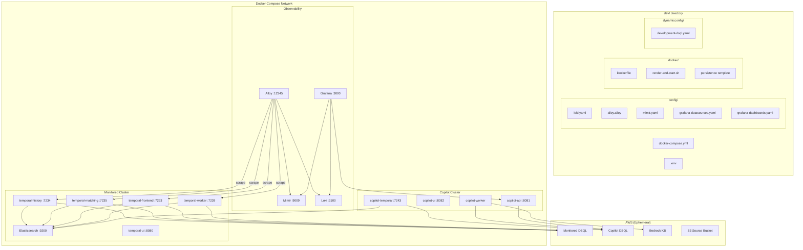

# Design Document: Standalone Dev Environment

## Overview

This design migrates the Copilot's local development environment from `temporal-dsql-deploy` into the `temporal-sre-copilot` repository. The result is a self-contained `dev/` directory with a Docker Compose stack (15 services), observability configs, a Temporal runtime Dockerfile, and Terraform for ephemeral AWS resources. A new `copilot dev` CLI subcommand group orchestrates the entire lifecycle.

The only external dependency retained is the `temporal-dsql` repository, needed to build the Go-based Temporal server binaries. Everything else — config files, templates, Terraform, dashboards, and CLI — lives in this repo.

### Design Decisions

1. **`dev/` directory at repo root** — Keeps dev environment artifacts separate from the production `terraform/envs/` and `packages/` directories. The `dev/` directory is self-contained: compose file, configs, Dockerfile, and env template.

2. **Two DSQL clusters in Terraform** — The monitored cluster and copilot cluster each get their own DSQL cluster. This mirrors the production topology and gives the Copilot realistic DSQL metrics to observe.

3. **Extend existing CLI** — The `copilot dev` subcommand group is added alongside `copilot db` and `copilot kb`. No new entry points or packages. The dev CLI uses `subprocess` to shell out to Docker Compose and Terraform, keeping the implementation simple and transparent.

4. **Config files copied, not symlinked** — Config files are copied from `temporal-dsql-deploy` into `dev/config/` and `dev/docker/`. This creates a clean fork point — the Copilot's dev environment can evolve independently.

5. **Grafana dashboards in `grafana/`** — Server and DSQL dashboards are added alongside the existing `grafana/copilot/` directory. The compose file mounts the entire `grafana/` directory, matching the existing `temporal-dsql-deploy` pattern.

## Architecture



### Service Port Mapping

| Service | Container Port | Host Port | Purpose |
|---------|---------------|-----------|---------|
| elasticsearch | 9200 | 9200 | Visibility store |
| temporal-frontend | 7233 | 7233 | Temporal gRPC API |
| temporal-frontend | 8233 | 8233 | Temporal HTTP API |
| temporal-history | 7234 | 7234 | History service |
| temporal-matching | 7235 | 7235 | Matching service |
| temporal-worker | 7239 | 7239 | Worker service |
| temporal-ui | 8080 | 8080 | Monitored cluster UI |
| mimir | 9009 | 9009 | Prometheus-compatible metrics |
| loki | 3100 | 3100 | Log aggregation |
| alloy | 12345 | 12345 | Metrics/log collection |
| grafana | 3000 | 3000 | Dashboards |
| copilot-temporal | 7233 | 7243 | Copilot Temporal gRPC |
| copilot-ui | 8080 | 8082 | Copilot cluster UI |
| copilot-api | 8080 | 8081 | Copilot JSON API |

## Components and Interfaces

### 1. Docker Compose Stack (`dev/docker-compose.yml`)

The compose file defines 15 services on a single `temporal-network` bridge network. Services are organized in three groups with explicit dependency ordering:

**Startup order:**
1. `elasticsearch` → `elasticsearch-setup` (init container, creates indices)
2. `temporal-history` → `temporal-matching` → `temporal-frontend` → `temporal-worker` → `temporal-ui`
3. `mimir`, `loki` (independent)
4. `alloy` (depends on mimir, loki, and Temporal services being healthy)
5. `grafana` (depends on mimir, loki)
6. `copilot-temporal` (depends on elasticsearch-setup)
7. `copilot-ui`, `copilot-worker`, `copilot-api` (depend on copilot-temporal)

**Image sources:**
- `temporal-dsql-runtime:test` — Built by `copilot dev build` from `dev/docker/Dockerfile`
- `temporal-sre-copilot:dev` — Built by `copilot dev build` from repo root `Dockerfile`
- All other images pulled from public registries (elasticsearch, temporalio/ui, grafana/*)

**Volume mounts:**
- `~/.aws` → read-only into all services needing IAM auth
- `dev/config/*` → read-only into respective services
- `dev/dynamicconfig/` → read-only into Temporal services
- `dev/docker/persistence-dsql-elasticsearch.template.yaml` → read-only into Temporal services
- `grafana/` → read-only into Grafana for dashboard provisioning
- Named volumes for persistent data: `elasticsearch-data`, `mimir-data`, `loki-data`, `grafana-data`

### 2. Temporal Runtime Image (`dev/docker/`)

Three files compose the runtime image layer:

- **`Dockerfile`** — `FROM temporal-dsql:latest`, copies the persistence template and entrypoint script. Validates base image structure (entrypoint exists, python3 available).
- **`render-and-start.sh`** — Bash entrypoint that uses Python's `string.Template` to substitute environment variables into the persistence YAML template. Validates required vars, checks for unsubstituted `$VAR` patterns, then `exec`s the base entrypoint.
- **`persistence-dsql-elasticsearch.template.yaml`** — Temporal server config with `$TEMPORAL_SQL_HOST`, `$TEMPORAL_ELASTICSEARCH_HOST`, etc. Defines DSQL as default store, Elasticsearch as visibility store, service ports, membership config, and dynamic config path.

### 3. Service Configurations (`dev/config/`)

| File | Service | Key Settings |
|------|---------|-------------|
| `loki.yaml` | Loki | Single-binary, filesystem storage, 72h retention, TSDB schema v13 |
| `alloy.alloy` | Alloy | 4 Prometheus scrape targets (15s interval), Docker log discovery, Mimir remote write, Loki log forwarding |
| `mimir.yaml` | Mimir | Single-binary, memberlist ring, 500k series limit, 100k ingestion rate |
| `grafana-datasources.yaml` | Grafana | Prometheus (Mimir), CloudWatch, Loki, Copilot JSON API datasources |
| `grafana-dashboards.yaml` | Grafana | 3 dashboard folders: Temporal, DSQL, Copilot |

### 4. Ephemeral Infrastructure (`terraform/dev/`)

Terraform module provisioning:

- **Two Aurora DSQL clusters** — `monitored` and `copilot`, both with `deletion_protection_enabled = false`
- **Bedrock Knowledge Base** — S3 Vectors storage, Titan Embed Text V2 embeddings (1024 dimensions, cosine distance)
- **S3 source bucket** — Versioned, encrypted, EventBridge notifications for KB ingestion
- **IAM role** — Bedrock KB service role with S3, S3 Vectors, and Bedrock InvokeModel permissions

**Outputs:** Both DSQL endpoints, KB ID, data source ID, S3 bucket names, region.

### 5. Dev CLI (`packages/copilot/src/copilot/cli/dev.py`)

Typer subcommand group with these commands:

```python
app = typer.Typer(no_args_is_help=True)

# Service lifecycle
@app.command()
def up(detach: bool = True): ...      # docker compose up [-d]

@app.command()
def down(volumes: bool = False): ...   # docker compose down [-v]

@app.command()
def ps(): ...                          # docker compose ps

@app.command()
def logs(service: str = ""): ...       # docker compose logs [-f] [service]

# Build
@app.command()
def build(): ...                       # Build both images

# Schema
schema_app = typer.Typer()
@schema_app.command()
def setup(): ...                       # Apply all schemas

# Infrastructure
infra_app = typer.Typer()
@infra_app.command()
def apply(): ...                       # terraform apply
@infra_app.command()
def destroy(): ...                     # terraform destroy
```

**Path resolution:**
- `dev/` directory: resolved relative to the repo root (detected via `pyproject.toml` or `.git/`)
- `temporal-dsql` repo: `TEMPORAL_DSQL_PATH` env var, defaulting to `../temporal-dsql`
- Terraform directory: `terraform/dev/` relative to repo root

**Subprocess execution:**
All external commands (docker compose, docker build, terraform) run via `subprocess.run()` with `check=True` and inherited stdout/stderr for real-time output. The CLI catches `subprocess.CalledProcessError` and translates to Rich-formatted error messages.

### 6. Grafana Dashboards (`grafana/`)

```
grafana/
├── copilot/copilot.json    # Already exists
├── server/server.json      # NEW: Temporal server health
├── dsql/persistence.json   # NEW: DSQL persistence metrics
└── provisioning/           # Already exists (may need updates)
```

The server and DSQL dashboards are copied from `temporal-dsql-deploy/grafana/`. The compose file mounts the entire `grafana/` directory at `/var/lib/grafana/dashboards`.

### 7. Documentation Updates

- **`README.md`** — New "Local Development" section with prerequisites, quick-start, and architecture overview
- **`AGENTS.md`** — Updated project structure, new `dev/` directory description, Dev_CLI commands
- **`dev/README.md`** — Detailed setup guide: prerequisites, step-by-step instructions, architecture diagram, port mapping, env var reference, troubleshooting
- **`Justfile`** — New `dev` recipe group: `dev-up`, `dev-down`, `dev-build`, `dev-logs`, `dev-ps`

## Data Models

### Environment Variables (`.env`)

The `.env` file is the primary configuration surface. Variables are grouped by cluster:

**Monitored Cluster:**
- `TEMPORAL_SQL_HOST` — DSQL endpoint (required)
- `TEMPORAL_SQL_PORT`, `TEMPORAL_SQL_USER`, `TEMPORAL_SQL_DATABASE` — Connection params (defaults provided)
- `TEMPORAL_SQL_PLUGIN`, `TEMPORAL_SQL_PLUGIN_NAME` — Always `dsql`
- `TEMPORAL_SQL_TLS_ENABLED`, `TEMPORAL_SQL_IAM_AUTH` — Always `true`
- `TEMPORAL_SQL_MAX_CONNS`, `TEMPORAL_SQL_MAX_IDLE_CONNS` — Pool size (default: 50)
- `TEMPORAL_SQL_CONNECTION_TIMEOUT`, `TEMPORAL_SQL_MAX_CONN_LIFETIME` — Timeouts
- `TEMPORAL_ELASTICSEARCH_*` — ES connection (defaults to local)
- `AWS_REGION`, `TEMPORAL_SQL_AWS_REGION` — AWS region
- `TEMPORAL_LOG_LEVEL`, `TEMPORAL_HISTORY_SHARDS` — Temporal config

**Copilot Cluster:**
- `COPILOT_DSQL_HOST` — Copilot DSQL endpoint (required)
- `COPILOT_DSQL_DATABASE` — Database name (default: `postgres`)
- `COPILOT_KNOWLEDGE_BASE_ID` — Bedrock KB ID (optional)

### Terraform Variables

| Variable | Type | Default | Description |
|----------|------|---------|-------------|
| `project_name` | string | — | Resource name prefix |
| `region` | string | `eu-west-1` | AWS region |

### Terraform Outputs

| Output | Description |
|--------|-------------|
| `monitored_dsql_endpoint` | Monitored cluster DSQL endpoint |
| `copilot_dsql_endpoint` | Copilot cluster DSQL endpoint |
| `knowledge_base_id` | Bedrock KB ID |
| `data_source_id` | Bedrock data source ID |
| `kb_source_bucket` | S3 bucket for KB documents |
| `region` | AWS region |


## Correctness Properties

*A property is a characteristic or behavior that should hold true across all valid executions of a system — essentially, a formal statement about what the system should do. Properties serve as the bridge between human-readable specifications and machine-verifiable correctness guarantees.*

### Property 1: ARM64 platform consistency

*For any* service defined in `dev/docker-compose.yml`, the service definition SHALL include `platform: linux/arm64`.

**Validates: Requirements 1.6**

### Property 2: AWS credential mounts for DSQL-dependent services

*For any* service in `dev/docker-compose.yml` that references a `TEMPORAL_SQL_HOST`, `COPILOT_DSQL_HOST`, or `AWS_REGION` environment variable, the service SHALL mount `~/.aws` as a read-only volume.

**Validates: Requirements 1.8**

### Property 3: Persistence template rendering completeness

*For any* complete set of required environment variables (all `TEMPORAL_SQL_*`, `TEMPORAL_ELASTICSEARCH_*`, and `TEMPORAL_HISTORY_SHARDS` variables defined), rendering the persistence template SHALL produce output containing no unsubstituted `$VARIABLE` patterns.

**Validates: Requirements 3.2**

### Property 4: Schema setup resilience

*For any* sequence of schema setup steps where one step fails, the Dev_CLI SHALL still attempt all remaining steps and report both successes and failures.

**Validates: Requirements 7.5**

## Error Handling

| Scenario | Behavior |
|----------|----------|
| `temporal-dsql` repo not found at configured path | `copilot dev build` prints error with expected path and `TEMPORAL_DSQL_PATH` env var hint, exits with code 1 |
| Docker Compose not installed or not running | CLI catches `FileNotFoundError` or `subprocess.CalledProcessError`, prints actionable error |
| Docker build fails (base image missing, network error) | CLI surfaces the Docker build error output, exits with code 1 |
| Terraform not installed | `copilot dev infra apply/destroy` catches missing binary, prints install instructions |
| Terraform apply fails (permissions, quota) | CLI surfaces Terraform error output, exits with code 1 |
| DSQL cluster not reachable during schema setup | Schema step reports connection error, continues with remaining steps |
| Elasticsearch not healthy during schema setup | Schema step reports error, continues with remaining steps |
| `.env` file missing when running `copilot dev up` | Docker Compose reports missing env vars; CLI suggests copying `.env.example` |
| Persistence template has unsubstituted variables | `render-and-start.sh` exits with error listing the unsubstituted variables |
| Required env vars missing for template rendering | `render-and-start.sh` exits with error listing missing variables |

## Testing Strategy

### Unit Tests

Unit tests verify specific examples and edge cases for the Dev CLI and configuration files:

- **CLI command construction**: Mock `subprocess.run` and verify correct Docker Compose / Terraform commands are constructed for each CLI command (`up`, `down`, `build`, `ps`, `logs`, `schema setup`, `infra apply`, `infra destroy`)
- **Path resolution**: Test repo root detection and `TEMPORAL_DSQL_PATH` resolution with various configurations
- **Error handling**: Test CLI behavior when `temporal-dsql` path doesn't exist, when subprocess calls fail
- **CLI registration**: Verify `copilot dev` subcommand is registered alongside `copilot db` and `copilot kb`
- **Backward compatibility**: Verify existing `copilot db` and `copilot kb` commands still exist and are callable

### Property-Based Tests

Property-based tests use Hypothesis to verify universal properties across generated inputs. Each test runs a minimum of 100 iterations.

- **Property 1** (ARM64 platform): Parse the compose file and verify all services have the correct platform. This is a structural property verified once against the actual file, not a generated-input property — implemented as a unit test.
- **Property 2** (AWS credential mounts): Same structural verification approach.
- **Property 3** (Template rendering): Generate random valid environment variable values using Hypothesis strategies, render the template, and verify no `$VAR` patterns remain. Tag: `Feature: standalone-dev, Property 3: Persistence template rendering completeness`
- **Property 4** (Schema setup resilience): Generate random sequences of pass/fail outcomes for schema steps, mock the subprocess calls accordingly, and verify all steps are attempted regardless of individual failures. Tag: `Feature: standalone-dev, Property 4: Schema setup resilience`

### Testing Libraries

- **pytest** — Test runner
- **hypothesis** — Property-based testing (already in the project)
- **unittest.mock** — Mocking subprocess calls for CLI tests

### Test File Location

Tests live in `tests/test_dev_cli.py` and `tests/properties/test_dev_environment.py`, following the existing project convention.
